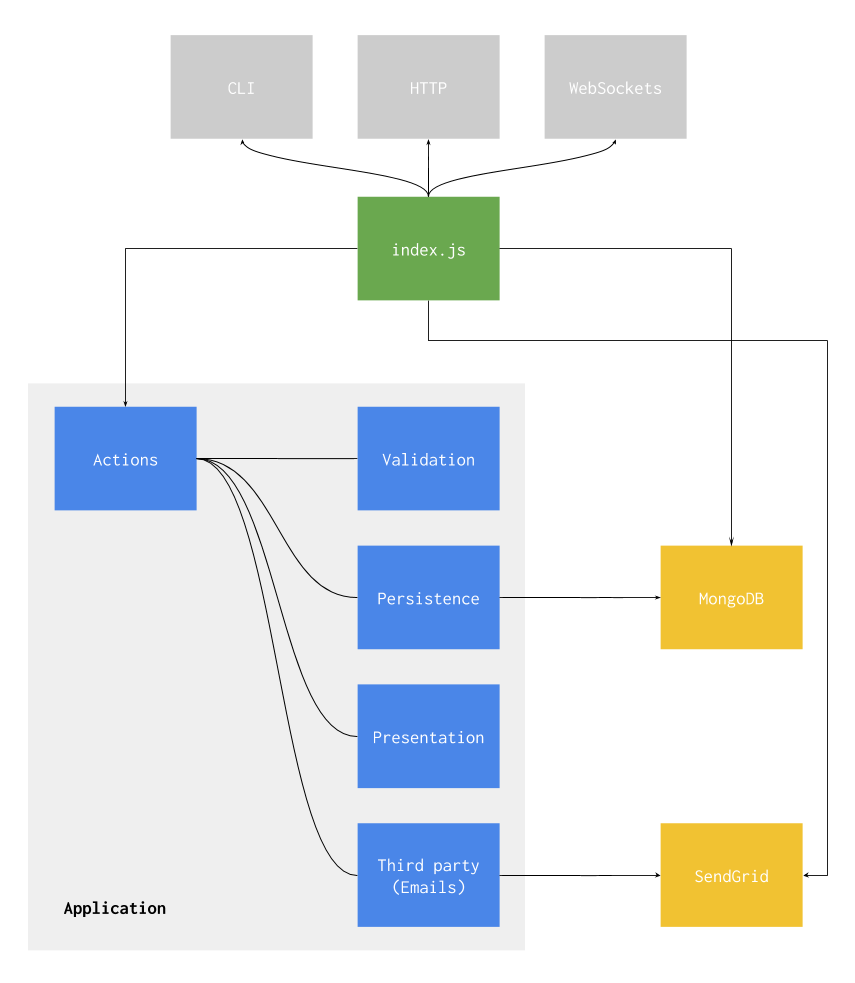

# Arquitectura

El concepto de arquitectura de software es muy ignorado por los programadores cuando empiezan a trabajar en un nuevo proyecto. O si se habla sobre arquitectura, es un concepto que se toma como resuelto hace años y que no vale la pena intentar mejorar.

En esta parte de curso vamos a ver como la arquitectura del software que construimos es algo que podemos controlar y que es importante hacerlo para que no sea un infierno mantener nuestro codigo en el futuro.

### Proposito de una arquitectura

[Segun Wikipedia](https://en.wikipedia.org/wiki/Software_architecture), la arquitectura de un software es una abstraction inteligible de un sistema complejo que nos permite tomar decisiones que luego de implementadas seria muy costoso volverlas para atras.

> Software architecture is an "intellectually graspable" abstraction of a complex system.

> Software architecture is about making fundamental structural choices that are costly to change once implemented.

Por otro lado, [Robert Martin en su presentacion "Clean Architecture"](https://www.youtube.com/watch?v=Nsjsiz2A9mg) insiste en que la arquitectura de software no deberia explicar *de que* esta hecho el software sino *para que* fue hecho. Tambien propone que el proposito de una arquitectura bien hecha es *atrasar* la toma de decisiones, no tomarlas de antemano.

> Architecture is about intent.

> The purpose of a good architecture is to defer decisions.

> A good architecture maximizes the number of decisions not made.

En los proyectos donde aplicamos la arquitectura como la explica Robert Martin pudimos ver enseguida los beneficios que el propone. Si vieras el codigo de uno de estos proyectos podrias entender rapidamente que tipo de software es y para que fue creado, gracias a que diseñamos su arquitectura con ese proposito.

Veamos cuales son las caracteristicas de nuestras arquitecturas que nos permiten expresar el "para que" del software.

#### [Use-case driven design](https://en.wikipedia.org/wiki/Use_case) y estructura de archivos

En la seccion que viene vamos a entrar en detalle sobre que es un caso de uso y como lo ponemos dentro del software en forma de codigo. Por ahora es necesario entender que nuestros proyectos estan organizados alrededor de las acciones que un usuario puede llevar a cabo con nuestro software y que a esas acciones les llamamos "casos de uso".

Por ejemplo, un usuario podria iniciar sesion, ver su perfil y actualizarlo. Eso se veria reflejado en los archivos de nuestro software, ya que cada una de esas acciones se transformaria en un archivo:

```
app/
  actions/
    create_session.js
    get_user_profile.js
    update_user_profile.js
  data/
  validation/
  presentation/
database/
http/
spec/
```

Como todos los casos de uso (o "acciones") estan a la vista inmediatamente, no necesitamos revisar el codigo ni ir mucho mas lejos para saber cual es el proposito de nuestro software. Si se tratara de un software para administrar inmuebles veriamos casos de usos como `agregar_inmueble` o `registrar_venta_de_inmueble`. Si fuera para subir fotos habria un caso de uso llamado `subir_foto`.

Adentro de los archivos tambien vamos a encontrar el codigo organizado de una manera que nos permite entender de que se trata a simple vista.

### [Use-case driven design](https://en.wikipedia.org/wiki/Use_case)

Un caso de uso es una lista de acciones que describen una interaccion del usuario con nuestro sistema. Cada caso de uso le da al usuario un resultado especifico y puede tener efectos secundarios sobre el sistema, como un cambio en la base de datos.

Hacer "use-case driven design" significa diseñar nuestro software en torno a sus casos de uso. Esto puede ser opuesto a pensar nuestro software como objetos que interactuan entre ellos como cuando diseñamos para la facultad usando UML y programacion orientada a objetos.

Diseñar nuestro software alrededor de los casos de uso nos permite enfocarnos mucho mas en las necesidades de nuestro usuario. Las necesidades de nuestros usuarios se pueden traducir casi directamente a casos de uso y luego a codigo, si diseñamos nuestra arquitectura de esta manera:

```javascript
function createSession(payload) {
  return Promise.resolve(payload)
    .then(findUserByEmailAndPassword)
    .then(saveNewSession)
    .then(presentNewSession);
}
```

Un caso de uso se traduce en una funcion cuya responsabilidad es ordenar los pasos del caso de uso, que tambien son funciones.

### [Railway oriented programming](https://fsharpforfunandprofit.com/posts/recipe-part2/)

Un nivel mas adentro, la funcion `saveNewSession` representa un paso en la interaccion entre el usuario y el sistema. Esta funcion forma parte de un [pipeline pattern](../javascript#pipeline-pattern) y por lo tanto su *input* va a ser el *output* de la funcion anterior.

"Railway oriented programming" es una idea bien divertida [que presento Scott Wlaschin en el 2014](https://www.youtube.com/watch?v=E8I19uA-wGY) y que explica bastante bien lo que pasa con este pipeline pattern. Funciona asi:


Nuestro caso de uso es una via por donde va a pasar un tren. Ese tren es una estructura de datos que tiene la informacion que precisamos para ejecutar el caso de uso.

Si queremos crear una nueva sesion, ese tren tiene el email y password del usuario. Para actualizar el perfil del usuario, el tren lleva la sesion y la informacion para actualizar el perfil.

Las funciones dentro del pipeline pueden ver lo que esta en el tren y pueden agregarle cosas. Las funciones que vienen despues ven el tren como quedo despues de pasar por la ultima estacion. Si aparece un error en alguna de las estaciones, el tren toma el camino rojo y no para en ninguna estacion mas.

Esto implica que las funciones que forman parte del pipeline tienen un requerimiento fijo y es que deben recibir al tren como input, y el tren debe salir como output. Debe ser el mismo tren, con la excepcion que lo que tiene adentro puede ser distinto.

Una funcion del pipeline se ve asi:

```javascript
/* La funcion recibe "payload" que es
   la estructura de datos que tiene la
   informacion para ejecutar el caso
   de uso. */
function saveNewSession(payload) {
  var session = { userId: payload.user.id };

  /* Las funciones del pipeline siempre
     devuelven una promesa para complementar
     con las funciones que son asincronicas. */
  return persistSession(session)
    .then(function (result) {
      /* La funcion agrega al payload la
         nueva sesion. Las funciones que
         vienen despues en el pipeline pueden
         hacer lo que quieran con ella. */
      payload.session = result;

      /* Retorna el mismo objeto que recibio
         para que lo reciba la siguiente
         funcion del pipeline. */
      return payload;
    });
}
```

### I/O as a plugin

El beneficio mas importante de diseñar la arquitectura de esta manera es que cada parte del sistema es muy facil de testear por separado. Muy facilmente podemos crear un test para la funcion `saveNewSession` sin ningun otro elemento del programa funcionando, solo la funcion y su test.

Al mismo tiempo es importante que los tests se ejecuten rapido. Si demoramos 5 o 10 minutos en ejecutar los tests, no vamos a poder ejecutarlos entre tarea y tarea y mucho menos mientras escribimos codigo. Para asegurarnos que nuestros tests corren rapido, tenemos que quitar las partes que son lentas por naturaleza, o sea el I/O.



#### Que es I/O

Le vamos a llamar I/O a toda comunicacion con otras cosas fuera del programa. Algunas operaciones comunes que podemos poner en la categoria de I/O son las consultas a bases de datos (comunicacion con otros programas), lectura y escritura de archivos (uso del disco duro) y llamadas a APIs externas (uso de la red).

#### Que es un plugin

Le vamos a llamar plugin a las cosas con las que nuestro programa puede trabajar porque se comporta de una manera determinada (implementa una interfaz), pero sin necesidad de saber que es ni de donde viene.

Podemos entender como funciona un plugin mirando la relacion que tiene un navegador web como Google Chrome con sus extensiones. Los programadores de Google no saben que extensiones hay disponibles en Internet ni desarrollan el software pensando en ellas, sin embargo las extensiones funcionan igual.

Cuando decimos que nuestro software va a tomar el I/O como un plugin, queremos decir que nuestras funciones van a recibir la funcionalidad de I/O por parametro y van a confiar (porque en Javascript no tenemos manera de exigir que implemente una interfaz) en que se van a comportar de la manera que tienen que comportarse.

#### En codigo

La siguiente es la funcion `saveNewSession` terminada. Usamos el [factory pattern](../javascript#factory-pattern) para crear la funcion del pipeline configurada con su funcion de I/O. Como la funcion de I/O es un plugin nos llega por parametro desde afuera.

En este caso la funcion de I/O va a hacer una consulta a las base de datos para guardar una nueva sesion. La funcion `saveNewSession` no necesita saber ningun detalle sobre la funcion, excepto que persiste una sesion.

```javascript
/* La funcion de I/O viene por parametro y
   de esta manera nos desacoplamos de la
   funcionalidad de persistencia. */
function saveNewSession(persistSession) {
  var session = { userId: payload.user.id };
  return persistSession(session)
    .then(function (result) {
      payload.session = result;
      return payload;
    });
}
```

En el test unitario de la funcion `saveNewSession` simplemente nos aseguramos que la funcion de persistencia haya sido llamada como corresponde.

```javascript
describe('saveNewSession', function () {
  var factory = require('./save_new_session.js');

  /* Creamos una funcion de persistencia falsa
     solo para ver como la llama `saveNewSession`
     y ver que pasa con el resultado. */
  function persistSession(params) {
    persistSession.params = params;
    persistSession.result = result;
    return Promise.resolve(persistSession.result);
  }

  it('saves session and returns payload', function (done) {
    /* Creamos la funcion pasandole la funcion
       de persistencia por parametro ya que es
       un plugin. */
    var fn = factory(persistSession);

    /* Creamos la estructura de datos que va a
       recibir la funcion. Mas adelante nos vamos
       a asegurar que lo que devuelve la funcion
       sea este mismo objeto. */
    var payload = { user: { id: Math.random() } };

    /* Ejecutamos la funcion pasandole la estructura
       de datos por parametro y le exigimos como
       primer requerimiento que devuelva un objeto
       `Promise` ya que usamos la funcion `then`
       sobre el resultado. */
    fn(payload).then(function (result) {
      /* El resultado de la ejecucion debe ser el
         mismo objeto que recibio por parametro ya
         que esta funcion pertenece al pipeline de
         un caso de uso. */
      expect(payload).toBe(result);

      /* Nos aseguramos que la funcion `saveNewsession`
         haya respetado la interfaz de la funcion de
         persistencia y haya enviado los parametros
         como corresponde. */
      expect(persistSession.params).toEqual({
        userId: payload.user.id
      });

      /* Nos aseguramos que la funcion `saveNewSession`
         este haciendo el uso correcto de lo que
         devuelve la funcion de persistencia. */
      expect(result.session).toBe(persistSession.result);

      done();
    });
  });
});
```

De esta manera nos mantenemos sin conocimiento de la funcionalidad de persistencia al mismo tiempo que nos aseguramos que estamos interactuando con ella correctamente.

<hr />

[](../tdd/)