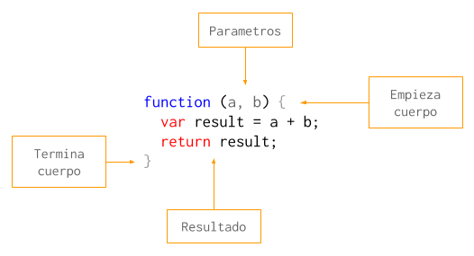
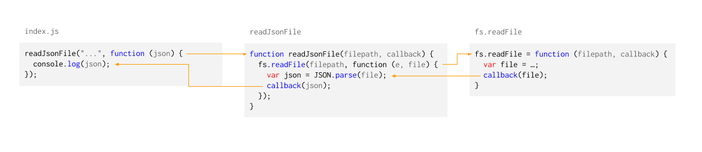
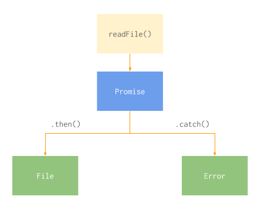
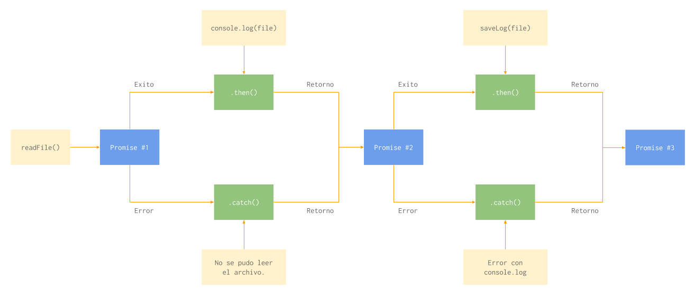
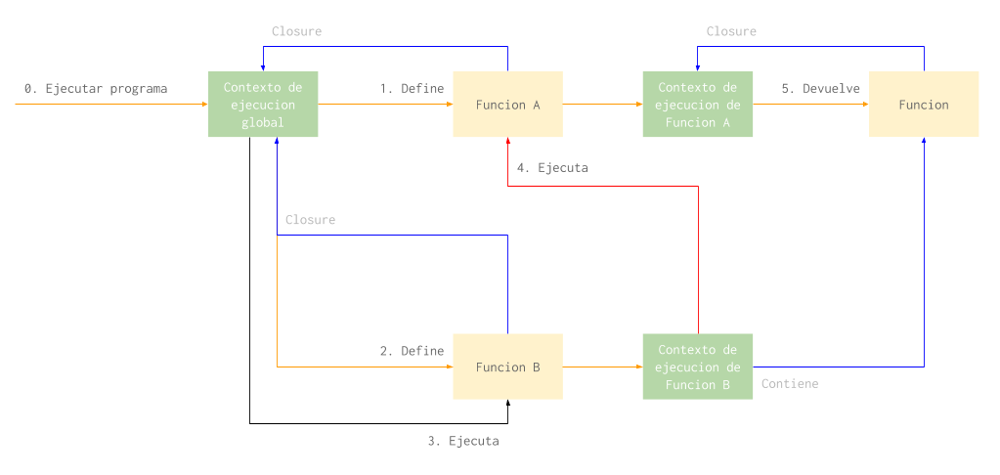

# Javascript

En esta parte del curso vamos a repasar algunos conceptos basicos de Javascript y otros no tan basicos. Javascript es nuestro lenguaje preferido porque es sencillo (a pesar de su sintaxis) y sirve tanto para frontend como para backend.

Vamos a empezar hablando de las funciones como el bloque fundamental del lenguaje sobre lo que vamos a construir todo lo demas.

### Funciones

Asi como un programa es un conjunto de sentencias que se ejecutan una despues de la otra, una funcion tambien se puede ver como una serie de sentencias que vamos a ejecutar mas tarde.

Los elementos que componen una funcion son los siguientes:

1. *Parametros*: Son variables que reciben su valor cada vez que se llama la funcion. Por ejemplo, si tuvieramos una funcion para sumar dos numeros, los numeros serian parametros y cambiarian con cada ejecucion de la funcion.
2. *Cuerpo*: El cuerpo de una funcion es donde estan las sentencias que se ejecutan cuando se ejecuta la funcion.
3. *Retorno*: Es el resultado de ejecutar la funcion. En el ejemplo de la suma, el retorno de la funcion es el resultado de la suma.



En Javascript, las funciones son objetos de "primera clase". Esto significa que una funcion en Javascript es un objeto propiamente dicho, que puede tener propiedades y hasta metodos.

No todos los lenguajes tienen esta caracteristica. En muchos lenguajes lo mas parecido a una funcion que podemos encontrar son los metodos, que solo pueden existir dentro de los objetos (en OOP) y nunca por si solos.

Como las funciones son objetos podemos guardarlas en variables y moverlas a distintas partes de nuestro programa. En la proxima parte vamos a ver como una funcion puede recibir a otra en sus parametros y que se puede hacer con eso.

### Callback

Se le llama "callback" a una funcion que se le pasa por parametro a otra funcion.



La palabra "call" significa "llamar" o "ejecutar" y "back" se puede traducir como "de vuelta" o "de regreso". En ingles decimos "call me back" cuando queremos que alguien nos "vuelva a llamar".

Los callbacks se usan cuando hay una tarea asincronica como leer un archivo o hacer una consulta a la base de datos. Usando callbacks podemos llamar, por ejemplo, a la funcion `readFile` y que nos notifique cuando la lectura del archivo haya terminado ejecutando la funcion que le pasamos por parametro.

Usar callbacks tiene un costo de prolijidad de codigo. El codigo de un programa con muchas tareas asincronicas y callbacks no es facil de leer.

```javascript
readJsonFile("...", function (json) {
  saveJsonToDatabase(json, function () {
    saveLog(function () {
      console.log('Success!')
    });
  });
});
```

Por eso es que hoy en dia vamos a encontrar mas librerias y funciones que prefieren usar `Promise` sobre callbacks.

```javascript
Promise.resolve()
  .then(function ()     { return readJsonFile("..."); })
  .then(function (json) { return saveJsonToDatabase(json); })
  .then(function ()     { return saveLog(); })
  .then(function ()     { console.log('Success!'); });
```

### Promise

Una promesa es un objeto que representa una tarea que todavia no termino de ejecutar. Esta tarea puede terminar exitosamente o no, y la interfaz de `Promise` nos permite interactuar con ambos casos.



Un objeto `Promise` tiene dos metodos llamados `then` y `catch`. El metodo `then` recibe una funcion como parametro (callback) que se ejecuta si la tarea que la promesa representa termina con exito. El metodo `catch` funciona de la misma manera, pero se ejecuta cuando la tarea termina en error. En ambos casos el callback recibe el resultado de la tarea.

```javascript
var promise = readFile(filepath);

promise.then(function (file) {
  console.log('Read successfully!', file);
});

promise.catch(function (error) {
  console.log('Could not read file!', error);
});
```

Los metodos `then` y `catch` son muy versatiles y nos permiten hacer muchas cosas distintas.

Por ejemplo, podemos llamar `then` tantas veces como queramos y asignarle mas de un callback a la misma tarea. Todos los callbacks en el siguiente ejemplo se ejecutan al terminar de leer el archivo:

```javascript
var promise = readFile(filepath);

/* Con este callback le vamos a avisar al
   usuario que el archivo se leyo con exito. */
promise.then(function (file) {
  console.log('Read successfully!', file);
});

/* En este vamos a dejar registro de que
   leimos el archivo. */
promise.then(function (file) {
  return saveLog(file);
});

/* En este vamos a copiar el archivo usando
   otra funcion. */
promise.then(function (file) {
  return copyFile(file, copypath);
});
```

Tambien podemos encadenar tareas asincronicas para que una empiece cuando termina la anterior. Esto lo podemos hacer porque tanto `then` como `catch` devuelven a su vez un nuevo objeto `Promise`. La tarea que reprensenta este nuevo objeto es la que lleva a cabo el callback.

En el ejemplo que viene, los callbacks no se ejecutan todos a la vez sino que uno se ejecuta cuando termina el anterior:

```javascript
var promise1 = readFile(filepath);
var promise2 = promise1.then(function (file) {
  console.log('Read successfully!', file);
  return file;
});
var promise3 = promise2.then(function (file) {
  return saveLog(file);
});
promise3.then(function (file) {
  return copyFile(file, copypath);
});
```

Escrito de otra manera, sin guardar cada promesa en una variable sino llamando directamente el metodo `then` sobre el resultado de la ejecucion anterior:

```javascript
readFile(filepath)
  .then(function (file) {
    console.log('Read successfully!', file);
    return file;
  })
  .then(function (file) {
    return saveLog(file);
  })
  .then(function (file) {
    return copyFile(file, copypath);
  });
```



Si quisieramos crear una funcion que devuelve un `Promise` podriamos hacerlo de la siguiente forma:

```javascript
/* Vamos a escribir nuesta propia funcion
   `readFile` que recibe el path de un
   archivo y devuelve el contenido. */
function readFile(filepath) {
  // Creamos una promesa con `new Promise`. 
  return new Promise(function (exito, error) {
    if (fileExists(filepath))
      // Hace que se ejecuten los `then`.
      exito({ }); 
    else
      // Hace que se ejecuten los `catch`.
      error('No existe el archivo.');
  });
}
```

Usamos `new Promise` para crear una nueva promesa y le pasamos la funcion que va a llevar a cabo la tarea. Esta funcion va a recibir dos funciones por parametro (`exito` y `error` en el ejemplo) que sirven para finalizar el `Promise`.

Si ejecutamos el primer callback (`exito`) vamos a estar marcando la promesa como finalizada exitosamente. El segundo callback (`error`) se ejecuta cuando hay un error. Ejecutar los callback hace que la promesa continue hacia los `then` o `catch` que se le hayan asignado.

Tambien podemos crear promesas usando los metodos `resolve` y `reject`. Con estos metodos creamos promesas que ya estan terminadas con exito y error respectivamente:

```javascript
Promise.resolve(123).then(function (value) {
  console.log(value); // Imprime 123
});

Promise.reject(789).catch(function (error) {
  console.log(error); // Imprime 789
});
```

### Closures

En esta parte vamos a ver en mas detalle que pasa cuando definimos y cuando ejecutamos una funcion.

En Javascript, una funcion se puede crear en cualquier momento de la ejecucion del programa. De hecho, cada vez que usamos la palabra clave `function` estamos creando una nueva funcion. Entonces un ejemplo como el siguiente crearia mucha cantidad de funciones:

```javascript
/* Creamos una funcion anonima para
   poder pasarsela como callback
/   a `forEach`. */
filepaths.forEach(function (filepath) {
  /* Creamos una funcion mas por cada vez
     que se ejecuta el callback de `forEach`.
     Cuando `forEach` termine  vamos a
     haber creado tantas funciones como
     archivos hubo en `filepaths`. */
  fs.readFile(filepath, function (error, file) {
    console.log('Leimos este archivo:', filepath, file);
  });
});
```

Cada vez que se crea una funcion, tambien se crea un "closure". Un closure es una referencia al contexto donde la funcion fue creada. La funcion "recuerda" en que contexto fue creada para poder usar sus variables.

Por ejemplo, en el codigo de arriba el callback de `readFile` puede acceder a la variable `filepath` porque fue creada dentro del callback de `forEach`.



Los closures viven en el programa hasta que la funcion a la que estan conectados desaparece. Para entender como es que una funcion desaparece del programa tenemos que hablar sobre contextos de ejecucion.

Cuando ejecutamos una funcion, el interprete de Javascript (NodeJS, un navegador web o donde sea que corre nuestro programa) reserva un espacio en la memoria del sistema para esa funcion.

En esta memoria se guardan los valores de los parametros y todas las variables que se definen dentro de la funcion. Cuando la funcion termina de ejecutar esta memoria se libera y las variables y parametros desaparecen. Si se definio una funcion dentro del contexto de ejecucion esta tambien desaparece.

```javascript
function doStuffWithFiles(filepaths) {
  filepaths.forEach(function (filepath) {
    fs.readFile(filepath, function (error, file) {
      // do stuff
    });
  });
}

/* El interprete va a reservar memoria para
   la ejecucion de esta funcion y al terminar
   de ejecutarla va a descartar los valores
   de los parametros, las variables y las
   funciones que se crearon en ese contexto.
   Esto incluye el callback de `forEach`,
   de `readFile` y las variables `filepaths`,
   `filepath`, `error` y `file`. */
doStuffWithFiles([...]);
```

La utilidad de los closure se puede ver cuando una funcion sobrevive al contexto de ejecucion donde fue creada. Si una ejecucion termina con el retorno de una funcion, la funcion retornada va a seguir existiendo y va a mantener vivo el contexto de ejecucion donde fue creada en su closure.

```javascript
/* La variable `publico` se define en el contexto
   ejecucion global y todas las funciones van a 
   tener acceso a ella. */
var publico = 123;

/* Esta funcion devuelve otra funcion.
   La funcion que devuelve va a tener acceso
   al contexto de ejecucion donde se creo.
   Entonces, la funcion que se devuelve va
   a poder leer la variable `secreto`. */
function prepararFuncionSecreta() {
  /* La variable `secreto` se define dentro
     del contexto de ejecucion de `prepararFuncionSecreta`. */
  var secreto = 456;

  /* La funcion `funcionSecreta` tambien se
     define dentro del contexto de ejecucion de
     `prepararFuncionSecreta` por lo tanto el
     sigue vivo en su closure. */
  return function funcionSecreta() {
    console.log(publico, secreto);
  };
}

/* La variable `fn` ahora tiene como valor a
   la `funcionSecreta`, que tiene en su closure
   el contexto de ejecucion de `prepararFuncionSecreta`. */
var fn = prepararFuncionSecreta();

/* Llamar a `fn` imprime 123456. 
   La `funcionSecreta` tiene acceso a la variable `secreto`
   a traves de su closure y a `publico` a traves del
   closure de `prepararFuncionSecreta`. */
fn();
```

A traves de los closures, el contexto de ejecucion de una funcion tiene acceso al contexto de ejecucion donde la funcion se creo. Este efecto se repite en cada funcion y asi cada funcion tiene acceso al contexto de ejecucion global a traves de los closures.

### Serializacion

Se le dice serializacion al proceso por el cual transformamos un objeto en un string u otro formato que se puede enviar fuera del programa. El formato que vamos a ver ahora es JSON (JavaScript Object Notation).

Cuando necesitamos enviar un objeto a otro programa, por ejemplo si nos comunicamos con un servidor web, tenemos que serializarlo primero. Como no podemos pasarle variables a otros programas, o a traves de una red, tenemos que enviarle un string.

Javascript tiene una libreria que viene incluida con el lenguaje para convertir objetos en strings JSON:

```javascript
JSON.stringify({ importante: 123456 }); // '{"importante":123456}'
```

Tambien convierte strings JSON en objetos:

```javascript
JSON.parse('{"importante":123456}'); // { importante: 123456 }
```

No se pueden serializar funciones por lo que explicamos en la seccion anterior. Para poder pasar el contexto entero de una funcion necesitariamos serializar el contexto de ejecucion global, o sea todo el programa.

[En esta pagina](https://developer.mozilla.org/en-US/docs/Web/JavaScript/Reference/Global_Objects/JSON#Full_JSON_syntax) podes encontrar la sintaxis JSON entera.

### Patrones de diseño

Para terminar con Javascript vamos a ver como se pueden aplicar algunos patrones de diseño. Estos patrones de diseño tienen uso mas que nada en lenguajes de programacion orientados a objetos pero tambien podemos aplicarlos usando el paradigma funcional, aunque parezca un poco improvisado.

Los patrones que vienen mas abajo son los que aplicamos todos los dias cuando programamos APIs y aplicaciones web. Los patrones que no usamos nos los vamos a ver.

#### [Command pattern](https://en.wikipedia.org/wiki/Command_pattern)

Un "command" en programacion orientada a objetos es un objeto ejecutable. Estos objetos tienen un metodo `execute` que hace lo que sea que el objeto tenga que hacer.

A estos objetos nosotros les llamamos funciones. Las funciones son basicamente objetos ejecutables e incluyen un metodo `call` aparte de la sintaxis `()` que tambien las ejecuta.

#### [Strategy pattern](https://en.wikipedia.org/wiki/Strategy_pattern)

El strategy pattern se usa cuando necesitamos elegir que funcion usar con el programa funcionando. Partes de nuestro sistema pueden variar segun el estado del sistema o segun otras cosas. O simplemente podemos aplicar el strategy pattern para nos sea mas facil mantener el codigo para determinadas funciones del sistema.

Veamos un ejemplo de como el sistema puede variar segun el estado. Este sistema de ejemplo registra la entrada y salida de personas de un edificio, y debe actuar diferente segun el horario en el que se registran las entradas. Cuando una persona entra entre las 22:00 y las 6:00, el sistema notifica a seguridad, fuera de ese horario notifica a recursos humanos.

Digamos que seguridad y recursos humanos son dos grupos diferentes de personas y que cada una quiere poder programar la manera en la que se les notifica. Podemos usar el strategy pattern para tener una funcion para cada grupo de personas.

```javascript
/* La funcion `notificar` es nuestra "estrategia"
   y va a variar segun como se llame a `registrarEntrada`.
   Esta funcion la va a mantener el equipo de TI. */
function registrarEntrada(entrada, notificar) { 
  validarEntrada(entrada);
  guardarEntradaEnBaseDeDatos(entrada);
  notificar(entrada);
}

/* Esta funcion la va a mantener el equipo de seguridad
   del edificio. */
function notificarSeguridad(entrada) {
  llamar911();
}

/* Esta funcion la va a mantener el equipo de recursos
   humanos de la empresa. */
function notificarRecursosHumanos(entrada) {
  empezarContadorDeHoras();
}

/* Nuestro sensor de entrada nos notifica cuando
   hay datos nuevos. */
sensor.addEventListener(function sensorActivado(sensorData) {
  var strategy;

  switch (new Date().getHours()) {
    case 22:
    case 23:
    case  0:
    case  1:
    case  2:
    case  3:
    case  4:
    case  5:
      strategy = notificarSeguridad;
      break;
    default:
      strategy = notificarRecursosHumanos;
  }

  registrarEntrada(sensorData, strategy);
});
```

Ahora veamos un ejemplo donde el mismo programador elige usar un strategy pattern para darse la libertad de poder cambiar facilmente una parte de la funcionalidad sin cambiar otras. En este caso el programador tiene que guardar un usuario en la base de datos, pero no esta seguro que base de datos es mejor.

Va a empezar usando MongoDB, pero capaz despues necesite cambiarse a PostgresSQL. Vamos a ver como podemos separar la logica de negocio (las reglas para guardar un usuario) y el codigo de base de datos.

```javascript
/* Nuestra funcion `guardarUsuario` sabe todo
   lo que se debe hacer para guardar un nuevo
   usuario en el sistema, excepto como persistirlo
   en la base de datos. */
function guardarUsuario(usuario, persistir) {
  usuario.id = generarIdUsuario();
  persistir(usuario);
  return usuario;
}

/* Esta funcion va a recibir datos del usuario
   y lo va a guardar en MongoDB. */
function persistirUsuarioEnMongoDb(usuario) {
  // ...
}

/* Esta funcion va a recibir datos del usuario
   y lo va a guardar en PostgresSQL.
   No necesitamos tener esta funcion hasta que
   realmente queramos usar PostgresSQL.
   De hecho, cambiar de base de datos es tan
   sencillo como crear un nuevo strategy. */
function persistirUsuarioEnPostgresSql(usuario) {
  // ...
}

function crearNuevoUsuario(inputUsuario) {
  validarInputUsuario(inputUsuario);

  /* En este caso no es una condicion del sistema
     la que decide que strategy usar, sino que el
     programador lo escribe asi para tener la
     comodidad de poder cambiarlo facilmente despues. */
  guardarUsuario(inputUsuario, persistirUsuarioEnMongoDb);

  enviarEmailNuevoUsuario(inputUsuario);
}
```

Una vez que tenemos instalado un stategy pattern, es sencillo agregar nuevas estrategias. Muy facilmente podriamos notificar a un tercer grupo sobre las entradas de personas y muy facilmente podriamos agregar codigo para base de datos.

#### [Factory pattern](https://en.wikipedia.org/wiki/Factory_(object-oriented_programming))

En programacion orientada a objetos, una "factory" es un objeto cuya responsabilidad es crear otros objetos. En programacion funcional, esta mas relacionado al concepto de "partial application".

Se puede aplicar este patron cuando la creacion del objeto es mas compleja que simplemente crear la funcion o usar `new` en lenguajes orientados a objetos. Por ejemplo, si necesitamos limitar la cantidad de objetos que existen de un tipo en particular o si la configuracion de un objeto es tan compleja que necesitamos especificarla en un objeto aparte.

Veamos un ejemplo de lo primero. Cuando nos conectamos a una base de datos no queremos estar creando conexiones nuevas a cada rato. Incluso si cerramos las conexiones que no vamos a usar mas para que no llegar al limite, el costo de conectarnos cada vez que hacemos una consulta es innecesario. Este problema se soluciona aplicando el factory pattern para controlar la creacion de conexiones.

Cuando ejecutemos la siguiente funcion nos va a dar una conexion que activa. Si no hubiera ninguna conexion activa crearia una nueva:

```javascript
var activa;

/* `conectar` aplica el factory pattern para
   controlar la creacion de conexiones a la
   base de datos. */
function conectar() {
  if (!activa)
    return baseDeDatos.conectar();
  else
    return activa;
}

/* Todas las conexiones a la base de datos se
   hacer a traves del factory. */
conectar().then(function (conexion) {
  conexion.consulta('...');
});
```

Ahora un ejemplo de configuracion compleja. Imaginemos un programa que usa [inyeccion de dependencia](https://en.wikipedia.org/wiki/Dependency_injection). Este programa tiene un objeto o funcion que tiene la sola responsabilidad de distribuir funcionalidad entre ciertos otros objetos del sistema.

Sigamos el ejemplo de strategy pattern que esta mas arriba donde pasamos la funcion de persistencia por parametro. En algun momento nuestro programa va a necesitar una funcion llamada `guardarUsuario` que simplemente guarde el usuario sin previa configuracion. Para hacer eso nuestra funcion de inyeccion de dependencias va a aplicar el factory pattern de manera que nos devuelva la funcion `guardarUsuario` ya configurada:

```javascript
/* La funcion `construirGuardarUsuario` aplica el
   factory pattern y devuelve una funcion ya configurada
   para usar MongoDB para la persistencia. */
function construirGuardarUsuario() {
  return function (usuario) {
    return guadarUsuario(usuario, persistirUsuarioEnMongoDb);
  };
}

var guardarUsuarioEnMongoDb = construirGuardarUsuario();
```