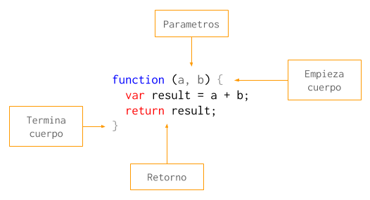

# Javascript

En esta parte del curso vamos a repasar algunos conceptos basicos de Javascript y otros no tan basicos. Javascript es nuestro lenguaje preferido porque es sencillo (a pesar de su sintaxis) y sirve tanto para frontend como para backend.

Vamos a empezar hablando de las funciones como el bloque fundamental del lenguaje sobre lo que vamos a construir todo lo demas.

### Funciones

Asi como un programa es un conjunto de sentencias que se ejecutan una despues de la otra, una funcion tambien se puede ver como una serie de sentencias que vamos a ejecutar mas tarde.

Los elementos que componen una funcion son los siguientes:

1. *Parametros*: Son variables que reciben su valor cada vez que se llama la funcion. Por ejemplo, si tuvieramos una funcion para sumar dos numeros, los numeros serian parametros y cambiarian con cada ejecucion de la funcion.
2. *Cuerpo*: El cuerpo de una funcion es donde estan las sentencias que se ejecutan cuando se ejecuta la funcion.
3. *Retorno*: Es el resultado de ejecutar la funcion. En el ejemplo de la suma, el retorno de la funcion es el resultado de la suma.



En Javascript, las funciones son objetos de "primera clase". Esto significa que una funcion en Javascript es un objeto propiamente dicho, que puede tener propiedades y hasta metodos.

No todos los lenguajes tienen esta caracteristica. En muchos lenguajes lo mas parecido a una funcion que podemos encontrar son los metodos, que solo pueden existir dentro de los objetos (en OOP) y nunca por si solos.

Como las funciones son objetos podemos guardarlas en variables y moverlas a distintas partes de nuestro programa. En la proxima parte vamos a ver como una funcion puede recibir a otra en sus parametros y que se puede hacer con eso.

### Callbacks

Se le llama "callback" a una funcion que se le pasa por parametro a otra funcion. Se llama asi porque cuando pasamos una funcion por parametro es para recuperar el control de flujo cuando se ejecute.


La palabra "call" significa "llamar" o "ejecutar" y "back" se puede traducir como "de vuelta" o "de regreso". En ingles decimos "call me back" cuando queremos que alguien nos "vuelva a llamar".

Los callbacks se usan cuando hay una tarea asincronica como leer un archivo o hacer una consulta a la base de datos. Usando callbacks podemos llamar, por ejemplo, a la funcion `readFile` y que nos notifique cuando la lectura del archivo haya terminado ejecutando la funcion que le pasamos por parametro.

Usar callbacks tiene un costo para la prolijidad del programa terminado. El codigo de un programa con muchas tareas asincronicas y callbacks no es muy legible.

```javascript
readJsonFile("...", function (json) {
  saveJsonToDatabase(json, function () {
    saveLog(function () {
      console.log('Success!')
    });
  });
});
```

Por eso es que hoy en dia vamos a encontrar mas librerias y funciones que prefieren usar `Promise` sobre callbacks.

```javascript
Promise.resolve()
  .then(function ()     { return readJsonFile("..."); })
  .then(function (json) { return saveJsonToDatabase(json); })
  .then(function ()     { return saveLog(); })
  .then(function ()     { console.log('Success!'); });
```

### Promise

Una promesa es un objeto que representa una tarea que todavia no termino de ejecutar. Esta tarea puede terminar exitosamente o no, y la interfaz de `Promise` nos permite interactuar con ambos casos.


Un objeto `Promise` tiene dos metodos llamados `then` y `catch`. El metodo `then` recibe una funcion como parametro (callback) que se ejecuta si la tarea que la promesa representa termina con exito. El metodo `catch` funciona de la misma manera, pero se ejecuta en caso que la tarea termine en error. En ambos casos el callback recibe el resultado de la tarea.

```javascript
var promise = readFile(filepath);

promise.then(function (file) {
  console.log('Read successfully!', file);
});

promise.catch(function (error) {
  console.log('Could not read file!', error);
});
```

Los metodos `then` y `catch` son muy versatiles y nos permiten hacer muchas cosas distintas.

Por ejemplo, podemos llamar `then` tantas veces como queramos y asignarle mas de un callback a la misma tarea. Todos los callbacks en el siguiente ejemplo se ejecutan al terminar de leer el mismo archivo:

```javascript
var promise = readFile(filepath);

// Con este callback le vamos a avisar al
// usuario que el archivo se leyo con exito.
promise.then(function (file) {
  console.log('Read successfully!', file);
});

// En este vamos a dejar registro de que
// leimos el archivo.
promise.then(function (file) {
  return saveLog(file);
});

// En este vamos a copiar el archivo usando
// otra funcion.
promise.then(function (file) {
  return copyFile(file, copypath);
});
```

Tambien podemos encadenar tareas asincronicas para que una empiece cuando termina la anterior. Esto lo podemos hacer porque tanto `then` como `catch` devuelven al ejecutarlos un nuevo objeto `Promise`. La tarea que reprensenta este nuevo objeto es la que lleva a cabo el callback.

En el ejemplo que viene, los callbacks no se ejecutan todos a la vez sino que uno se ejecuta cuando termina el anterior:

```javascript
var promise1 = readFile(filepath);
var promise2 = promise1.then(function (file) {
  console.log('Read successfully!', file);
  return file;
});
var promise3 = promise2.then(function (file) {
  return saveLog(file);
});
promise3.then(function (file) {
  return copyFile(file, copypath);
});
```

Escrito de otra manera, sin guardar cada promesa en una variable sino llamando directamente el metodo `then` sobre el resultado de la ejecucion anterior:

```javascript
readFile(filepath)
  .then(function (file) {
    console.log('Read successfully!', file);
    return file;
  })
  .then(function (file) {
    return saveLog(file);
  })
  .then(function (file) {
    return copyFile(file, copypath);
  });
```

