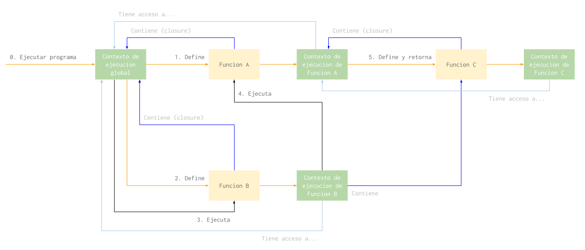

# Javascript

En esta parte del curso vamos a repasar algunos conceptos basicos de Javascript y otros no tan basicos. Javascript es nuestro lenguaje preferido porque es sencillo (a pesar de su sintaxis) y sirve tanto para frontend como para backend.

Vamos a empezar hablando de las funciones como el bloque fundamental del lenguaje sobre lo que vamos a construir todo lo demas.

### Funciones

Asi como un programa es un conjunto de sentencias que se ejecutan una despues de la otra, una funcion tambien se puede ver como una serie de sentencias que vamos a ejecutar mas tarde.

Los elementos que componen una funcion son los siguientes:

1. *Parametros*: Son variables que reciben su valor cada vez que se llama la funcion. Por ejemplo, si tuvieramos una funcion para sumar dos numeros, los numeros serian parametros y cambiarian con cada ejecucion de la funcion.
2. *Cuerpo*: El cuerpo de una funcion es donde estan las sentencias que se ejecutan cuando se ejecuta la funcion.
3. *Retorno*: Es el resultado de ejecutar la funcion. En el ejemplo de la suma, el retorno de la funcion es el resultado de la suma.


En Javascript, las funciones son objetos de "primera clase". Esto significa que una funcion en Javascript es un objeto propiamente dicho, que puede tener propiedades y hasta metodos.

No todos los lenguajes tienen esta caracteristica. En muchos lenguajes lo mas parecido a una funcion que podemos encontrar son los metodos, que solo pueden existir dentro de los objetos (en OOP) y nunca por si solos.

Como las funciones son objetos podemos guardarlas en variables y moverlas a distintas partes de nuestro programa. En la proxima parte vamos a ver como una funcion puede recibir a otra en sus parametros y que se puede hacer con eso.

### Callbacks

Se le llama "callback" a una funcion que se le pasa por parametro a otra funcion. Se llama asi porque cuando pasamos una funcion por parametro es para recuperar el control de flujo cuando se ejecute.


La palabra "call" significa "llamar" o "ejecutar" y "back" se puede traducir como "de vuelta" o "de regreso". En ingles decimos "call me back" cuando queremos que alguien nos "vuelva a llamar".

Los callbacks se usan cuando hay una tarea asincronica como leer un archivo o hacer una consulta a la base de datos. Usando callbacks podemos llamar, por ejemplo, a la funcion `readFile` y que nos notifique cuando la lectura del archivo haya terminado ejecutando la funcion que le pasamos por parametro.

Usar callbacks tiene un costo para la prolijidad del programa terminado. El codigo de un programa con muchas tareas asincronicas y callbacks no es muy legible.

```javascript
readJsonFile("...", function (json) {
  saveJsonToDatabase(json, function () {
    saveLog(function () {
      console.log('Success!')
    });
  });
});
```

Por eso es que hoy en dia vamos a encontrar mas librerias y funciones que prefieren usar `Promise` sobre callbacks.

```javascript
Promise.resolve()
  .then(function ()     { return readJsonFile("..."); })
  .then(function (json) { return saveJsonToDatabase(json); })
  .then(function ()     { return saveLog(); })
  .then(function ()     { console.log('Success!'); });
```

### Promise

Una promesa es un objeto que representa una tarea que todavia no termino de ejecutar. Esta tarea puede terminar exitosamente o no, y la interfaz de `Promise` nos permite interactuar con ambos casos.


Un objeto `Promise` tiene dos metodos llamados `then` y `catch`. El metodo `then` recibe una funcion como parametro (callback) que se ejecuta si la tarea que la promesa representa termina con exito. El metodo `catch` funciona de la misma manera, pero se ejecuta en caso que la tarea termine en error. En ambos casos el callback recibe el resultado de la tarea.

```javascript
var promise = readFile(filepath);

promise.then(function (file) {
  console.log('Read successfully!', file);
});

promise.catch(function (error) {
  console.log('Could not read file!', error);
});
```

Los metodos `then` y `catch` son muy versatiles y nos permiten hacer muchas cosas distintas.

Por ejemplo, podemos llamar `then` tantas veces como queramos y asignarle mas de un callback a la misma tarea. Todos los callbacks en el siguiente ejemplo se ejecutan al terminar de leer el mismo archivo:

```javascript
var promise = readFile(filepath);

// Con este callback le vamos a avisar al
// usuario que el archivo se leyo con exito.
promise.then(function (file) {
  console.log('Read successfully!', file);
});

// En este vamos a dejar registro de que
// leimos el archivo.
promise.then(function (file) {
  return saveLog(file);
});

// En este vamos a copiar el archivo usando
// otra funcion.
promise.then(function (file) {
  return copyFile(file, copypath);
});
```

Tambien podemos encadenar tareas asincronicas para que una empiece cuando termina la anterior. Esto lo podemos hacer porque tanto `then` como `catch` devuelven a su vez un nuevo objeto `Promise`. La tarea que reprensenta este nuevo objeto es la que lleva a cabo el callback.

En el ejemplo que viene, los callbacks no se ejecutan todos a la vez sino que uno se ejecuta cuando termina el anterior:

```javascript
var promise1 = readFile(filepath);
var promise2 = promise1.then(function (file) {
  console.log('Read successfully!', file);
  return file;
});
var promise3 = promise2.then(function (file) {
  return saveLog(file);
});
promise3.then(function (file) {
  return copyFile(file, copypath);
});
```

Escrito de otra manera, sin guardar cada promesa en una variable sino llamando directamente el metodo `then` sobre el resultado de la ejecucion anterior:

```javascript
readFile(filepath)
  .then(function (file) {
    console.log('Read successfully!', file);
    return file;
  })
  .then(function (file) {
    return saveLog(file);
  })
  .then(function (file) {
    return copyFile(file, copypath);
  });
```


### Closures

En esta parte vamos a ver en mas detalle que pasa cuando definimos y cuando ejecutamos una funcion.

En Javascript, una funcion se puede crear en cualquier momento de la ejecucion del programa. De hecho, cada vez que usamos la palabra clave `function` estamos creando una nueva funcion. Entonces un ejemplo como el siguiente crearia mucha cantidad de funciones:

```javascript
// Creamos una funcion anonima para
// poder pasarsela como callback
// a `forEach`.
filepaths.forEach(function (filepath) {
  // Creamos una funcion mas por cada vez
  // que se ejecuta el callback de `forEach`.
  // Cuando `forEach` termine  vamos a
  // haber creado tantas funciones como
  // archivos hubo en `filepaths`.
  fs.readFile(filepath, function (error, file) {
    console.log('Leimos este archivo:', filepath, file);
  });
});
```

Cada vez que se crea una funcion, tambien se crea un "closure". Un closure es una referencia al contexto donde la funcion fue creada. La funcion "recuerda" en que contexto fue creada para poder usar sus variables.

Por ejemplo, en el codigo de arriba el callback de `readFile` puede acceder a la variable `filepath` porque fue creada dentro del callback de `forEach`.

Los closures viven en el programa hasta que la funcion a la que estan conectados desaparece. Para entender como es que una funcion desaparece del programa tenemos que hablar sobre contextos de ejecucion.

Cuando ejecutamos una funcion, el interprete de Javascript (NodeJS, un navegador web o donde sea que corre nuestro programa) reserva un espacio en la memoria del sistema para esa funcion.

En esta memoria se guardan los valores de los parametros y todas las variables que se definen dentro de la funcion. Cuando la funcion termina de ejecutar esta memoria se libera y las variables y parametros desaparecen. Si se definio una funcion dentro del contexto de ejecucion esta tambien desaparece.

```javascript
function doStuffWithFiles(filepaths) {
  filepaths.forEach(function (filepath) {
    fs.readFile(filepath, function (error, file) {
      // do stuff
    });
  });
}

// El interprete va a reservar memoria para
// la ejecucion de esta funcion y al terminar
// de ejecutarla va a descartar los valores
// de los parametros, las variables y las
// funciones que se crearon en ese contexto.
// Esto incluye el callback de `forEach`,
// de `readFile` y las variables `filepaths`,
// `filepath`, `error` y `file`.
doStuffWithFiles([...]);
```

El uso de los closure se puede ver cuando una funcion sobrevive al contexto de ejecucion donde fue creada. Si una ejecucion termina con el retorno de una funcion, la funcion retornada va a seguir existiendo y va a mantener vivo el contexto de ejecucion donde fue creada en su closure.



A traves de los closures, el contexto de ejecucion de una funcion tiene acceso al contexto de ejecucion donde la funcion se creo. Este efecto se repite en cada funcion y asi cada funcion tiene acceso al contexto de ejecucion global a traves de los closures.

### Serializacion

Se le dice serializacion al proceso por el cual transformamos un objeto en un string u otro formato que se puede enviar fuera del programa. El formato que vamos a ver ahora es JSON (JavaScript Object Notation).

Cuando necesitamos enviar un objeto a otro programa, por ejemplo si nos comunicamos con un servidor web, tenemos que serializarlo primero. Como no podemos pasarle variables a otros programas, o a traves de una red, tenemos que enviarle un string.

Javascript tiene una libreria que viene incluida con el lenguaje para convertir objetos en strings JSON:

```javascript
JSON.stringify({ importante: 123456 }); // '{"importante":123456}'
```

Tambien convierte strings JSON en objetos:

```javascript
JSON.parse('{"importante":123456}'); // { importante: 123456 }
```

No se pueden serializar funciones por lo que explicamos en la seccion anterior. Para poder pasar el contexto entero de una funcion necesitariamos serializar el contexto de ejecucion global, o sea todo el programa.

[En esta pagina](https://developer.mozilla.org/en-US/docs/Web/JavaScript/Reference/Global_Objects/JSON#Full_JSON_syntax) podes encontrar la sintaxis JSON entera.

### Patrones de diseño

Para terminar con Javascript vamos a ver como se pueden aplicar algunos patrones de diseño. Estos patrones de diseño tienen uso mas que nada en lenguajes de programacion orientados a objetos pero tambien podemos aplicarlos usando el paradigma funcional, aunque parezca un poco improvisado.

Los patrones que vienen mas abajo son los que aplicamos todos los dias cuando programamos APIs y aplicaciones web. Los patrones que no usamos nos los vamos a ver.

#### [Command pattern](https://en.wikipedia.org/wiki/Command_pattern)

Un "command" en programacion orientada a objetos es un objeto ejecutable. Estos objetos tienen un metodo `execute` que hace lo que sea que el objeto tenga que hacer.

A estos objetos nosotros les llamamos funciones. Las funciones son basicamente objetos ejecutables. La sintaxis `()` es simplemente un atajo para `hacerAlgo.call()`.

Las arquitecturas que creamos con funciones se pueden reproducir en lenguajes orientados a objetos usando el command pattern en todos lados.

