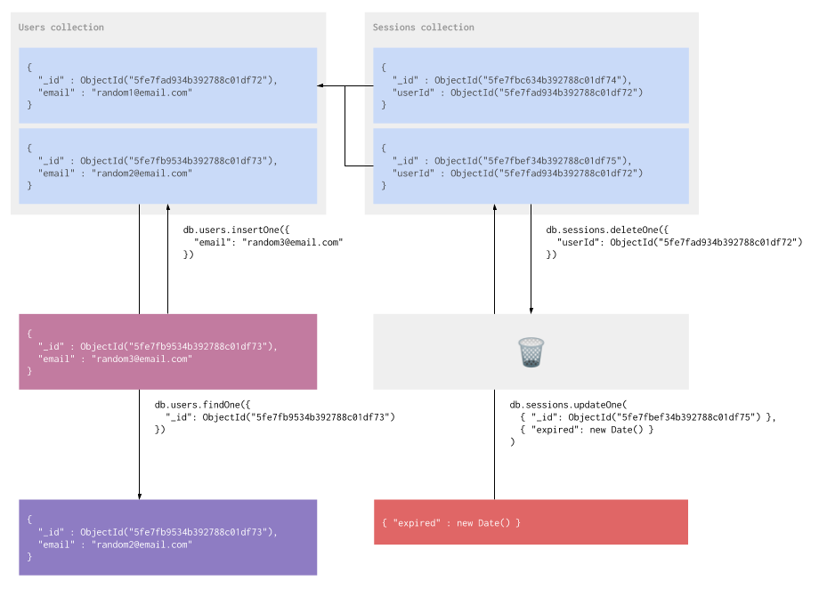

# MongoDB

MongoDB es una base de datos no relacional. En MongoDB guardamos los datos en forma de *documentos* que se organizan en *colecciones* y creamos *indices* para mejorar el rendimiento de las consultas.

### Funcion

MongoDB es una herramienta super flexible gracias a que es no relacional y no requiere que definamos el schema de antemano. Nos permite persistir datos rapidamente para crear tests automatizados y nos da una API para consultarlos que es mucho mas accesible que SQL.



### `insertOne` & `insertMany`

Para agregar un nuevo documento a una coleccion usamos `insertOne`. Podemos usar `insertMany` si tenemos mas de un documento y queremos agregarlos todos al mismo tiempo.

No necesitamos hacer nada antes de poder agregar un documento a una coleccion. Si la coleccion no existe MongoDB la crea automaticamente.

Desde la consola:

```javascript
> db.users.insertOne({ email: 'random3@email.com' })
{
        "acknowledged" : true,
        "insertedId" : ObjectId("5fe802e9538755d73dbb3ca2")
}
```

```javascript
> db.users.find()
{ "_id" : ObjectId("5fe7fad934b392788c01df72"), "email" : "random1@email.com" }
{ "_id" : ObjectId("5fe7fb9534b392788c01df73"), "email" : "random2@email.com" }
{ "_id" : ObjectId("5fe802e9538755d73dbb3ca2"), "email" : "random3@email.com" } 
```

Desde Javascript:

```javascript
var user = { email: 'random3@email.com' };
var connection;

connectToMongo()
  .then(function (c) {
    connection = c;
  })
  .then(function () {
    return connection
      .collection('users')
      .insertOne(user);
  })
  .then(function () {
    console.log(user);
    // { _id: ObjectId("5fe802e9538755d73dbb3ca2"), email: 'random3@email.com' }
  })
  .then(function () {
    return connection
      .collection('users')
      .find()
      .toArray();
  })
  .then(function (documents) {
    console.log(documents);
    // [
    //   { _id: ObjectId("5fe7fad934b392788c01df72"), email: "random1@email.com" },
    //   { _id: ObjectId("5fe7fb9534b392788c01df73"), email: "random2@email.com" },
    //   { _id: ObjectId("5fe802e9538755d73dbb3ca2"), email: "random3@email.com" }
    // ]
  })
```

La firma de la funcion `insertMany` recibe un array en vez de un objeto.

```javascript
> db.users.insertMany([ { email: 'random4@email.com' }, { email: 'random5@email.com' } ])
{
        "acknowledged" : true,
        "insertedIds" : [
                ObjectId("5fe80501531d44e7d62f5c74"),
                ObjectId("5fe80501531d44e7d62f5c75")
        ]
}
```

```javascript
> db.users.find()
{ "_id" : ObjectId("5fe7fad934b392788c01df72"), "email" : "random1@email.com" }
{ "_id" : ObjectId("5fe7fb9534b392788c01df73"), "email" : "random2@email.com" }
{ "_id" : ObjectId("5fe802e9538755d73dbb3ca2"), "email" : "random3@email.com" }
{ "_id" : ObjectId("5fe80501531d44e7d62f5c74"), "email" : "random4@email.com" }
{ "_id" : ObjectId("5fe80501531d44e7d62f5c75"), "email" : "random5@email.com" }
```

### `deleteOne` & `deleteMany`

Estas funciones eliminan documentos de una coleccion. Igual que con `insertOne` e `insertMany`, la diferencia entre `deleteOne` y `deleteMany` esta en que el segundo recibe un array.

Lo que recibe por parametro es un objeto que MongoDB va a comparar con los documentos de la coleccion. Cualquier documento que tenga el mismo valor para cada una de las claves es candidato para la operacion. Tambien existen operadores que modifican este comportamiento y permiten hacer consultas mas complejas.

Por ejemplo, vamos a llamar la funcion `deleteOne` con `{ _id: ObjectId("5fe7fad934b392788c01df72") }` como parametro. Como la funcion elimina un solo documento, MongoDB se va a quedar con el primero que encuentre que cumpla con las condiciones. En este caso, la condicion es que el campo `_id` debe ser igual a `ObjectId("5fe7fad934b392788c01df72")`.

Desde la consola:

```javascript
> db.users.deleteOne({ _id: ObjectId("5fe7fad934b392788c01df72") })
{ "acknowledged" : true, "deletedCount" : 1 }
```

```javascript
> db.users.find()
{ "_id" : ObjectId("5fe7fb9534b392788c01df73"), "email" : "random2@email.com" }
{ "_id" : ObjectId("5fe802e9538755d73dbb3ca2"), "email" : "random3@email.com" }
{ "_id" : ObjectId("5fe80501531d44e7d62f5c74"), "email" : "random4@email.com" }
{ "_id" : ObjectId("5fe80501531d44e7d62f5c75"), "email" : "random5@email.com" }
```

Desde Javascript:

```javascript
var query = {
  _id: mongoObjectId('5fe7fad934b392788c01df72')
};

connectToMongo().then(function (connection) {
  return connection
    .collection('users')
    .deleteOne(query);
})
```

### `findOne`

Esta funcion es la que usamos cuando queremos consultar la base de datos y conseguir un solo documento. Recibe un objeto de la misma forma que usamos arriba con la funcion `deleteOne` y devuele el primer documento que encuentra.

Desde la consola:

```javascript
> db.users.findOne({ email: 'random2@email.com' })
{
        "_id" : ObjectId("5fe7fb9534b392788c01df73"),
        "email" : "random2@email.com"
}
```

Desde Javascript:

```javascript
var query = { email: 'random2@email.com' };

connectToMongo()
  .then(function (connection) {
    return connection
      .collection('users')
      .findOne(query);
  })
  .then(function (result) {
    // ...
  })
```

### `find`

La funcion `find` es diferente a `findOne` porque no devuelve un documento sino un *cursor*. Para no cargar todos los posibles resultados de una consulta todos a la vez, MongoDB devuelve un iterador que nos va dando los resultados de a pocos.

Desde la consola:

```javascript
> db.users.find()
{ "_id" : ObjectId("5fe7fb9534b392788c01df73"), "email" : "random2@email.com" }
{ "_id" : ObjectId("5fe802e9538755d73dbb3ca2"), "email" : "random3@email.com" }
{ "_id" : ObjectId("5fe80501531d44e7d62f5c74"), "email" : "random4@email.com" }
{ "_id" : ObjectId("5fe80501531d44e7d62f5c75"), "email" : "random5@email.com" }
```

En este caso son pocos los resultados y entonces el cursor imprime todos los resultados. Si fueran mas resultados, tendriamos que correr `it` para seguir iterando sobre el cursor para conseguir la siguiente pagina de resultados.

Desde Javascript:

```javascript
connectToMongo()
  .then(function (connection) {
    return connection
      .collection('users')
      .find();
  })
  .then(function (cursor) {
    cursor.forEach(function (user) {
      // ...
    });
  })
```

`find` tambien recibe un objeto como parametro que funciona igual que `findOne` y `deleteOne`.

### `updateOne` & `updateMany`

Estas funciones se usan para modificar documentos. El primer parametro de ambas funciona igual que en `deleteOne` y `deleteMany`, con la misma diferenciacion entre `One` y `Many`.

`updateOne` y `updateMany` tambien reciben un segundo parametro que le va a explicar a MongoDB como debe cambiar los documentos a medida que los encuentra. Este segundo parametro es un objeto y sus claves (en el primer nivel) deben corresponder a las operaciones de MongoDB.

En el siguiente ejemplo vamos a actualizar uno de los usuarios y le vamos a agregar un nombre `{ name: 'Random User 3' }` usando la operacion `$set`:

Desde la consola:

```javascript
> db.users.updateOne({ email: 'random3@email.com' }, { $set: { name: 'Random User 3' } })
{ "acknowledged" : true, "matchedCount" : 1, "modifiedCount" : 1 }
```

```javascript
> db.users.find()
{ "_id" : ObjectId("5fe7fb9534b392788c01df73"), "email" : "random2@email.com" }
{ "_id" : ObjectId("5fe802e9538755d73dbb3ca2"), "email" : "random3@email.com", "name" : "Random User 3" }
{ "_id" : ObjectId("5fe80501531d44e7d62f5c74"), "email" : "random4@email.com" }
{ "_id" : ObjectId("5fe80501531d44e7d62f5c75"), "email" : "random5@email.com" }
````

Desde Javascript:

```javascript
var query = { email: 'random3@email.com' };
var update = { $set: { name: 'Random User 3' } };

connectToMongo().then(function (connection) {
  return connection
    .collection('users')
    .updateOne(query, update);
})
```

### Object IDs

En los ejemplos de arriba vas a ver que aparecen las funciones `ObjectId` (consola) y `mongoObjectId` (Javascript). Estas dos funciones reciben strings y devuelven un tipo especial que MongoDB usa para crear los valores de los campos `_id`.

Hay que tener en cuenta la diferencia entre este tipo especial y string. Si estas haciendo una consulta y no te devuelve nada, puede ser porque le estas pasando un string sin convertirlo en un `ObjectId`.

```javascript
> db.users.findOne({ _id: '5fe7fb9534b392788c01df73' })
null
```

```javascript
> db.users.findOne({ _id: ObjectId('5fe7fb9534b392788c01df73') })
{
        "_id" : ObjectId("5fe7fb9534b392788c01df73"),
        "email" : "random2@email.com"
}
```

### Indices

Cuando hay muchos datos guardados en una coleccion las consultas pueden demorar mucho en devolver un resultado. Si no hay indices creados para una coleccion, MongoDB tiene que recorrer la coleccion entera para encontrar los documentos que corresponden con la consulta.

Un indice es basicamente una estructura de datos que tiene informacion sobre una determinada coleccion ordenada de una determinada manera. Para crear un indice debemos indicarle a MongoDB en que orden queremos que se ordenen los documentos de una coleccion.

Si hubieran millones de usuarios y estuvieramos buscandolos por email, un indice creado como se muestra abajo nos ayudaria a acelerar la consulta:

```javascript
> db.users.createIndex({ email: 1 })
{
        "createdCollectionAutomatically" : false,
        "numIndexesBefore" : 1,
        "numIndexesAfter" : 2,
        "ok" : 1
}
```

Sin este indice MongoDB tendria que ir uno a uno por todos los usuarios, ordenados por ID, comparando el valor de `email` con el valor de la consulta. Pero como creamos este indice, puede recorrer la coleccion de usuarios ordenados por email y no tiene que empezar desde el principio, porque tambien sabe aproximadamente en que posicion esta el email que esta buscando.

Se puede encontrar mas informacion sobre indices aca: [Indexes](https://docs.mongodb.com/manual/indexes/).

<hr />

<table cellpadding="0" cellspacing="0" border="0">
  <tr>
    <td>[](../javascript/)</td>
    <td>[](https://youtube.com/watch?v=Vescsbo3VC0)</td>
  </td>
</table>
