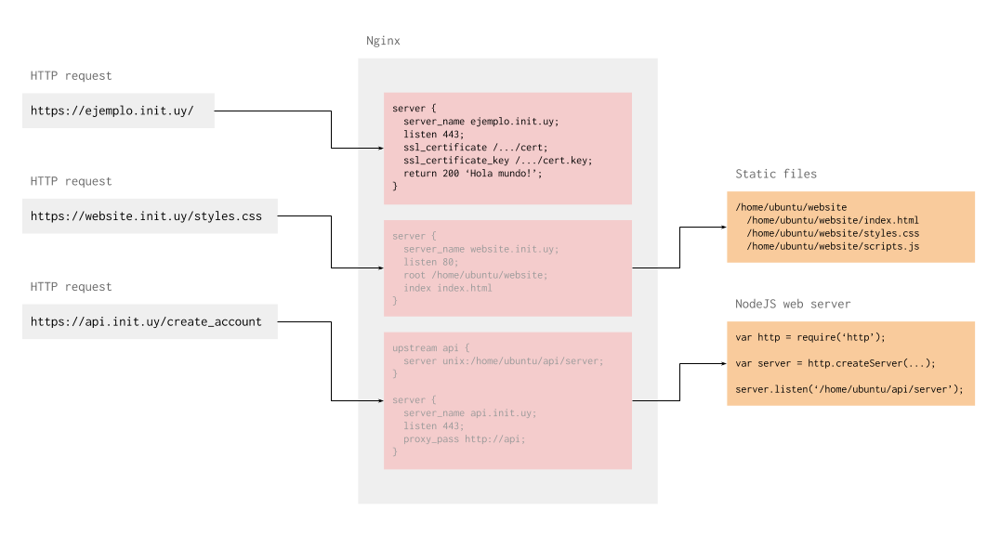

# Nginx

Nginx es un servidor web que requiere muy poca configuracion. Lo instalamos en las maquinas virtuales para servir paginas web mientras las desarrollamos y tambien para agregarle HTTPS a nuestras APIs.

### Funcion

Usamos Nginx para distribuir el trafico web entre diferente proyectos y para asegurarlo usando HTTPS. Elegimos Nginx sobre otros servidores web por lo facil que es configurarlo.

