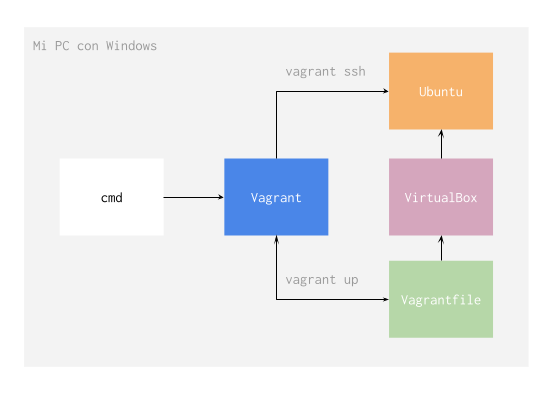
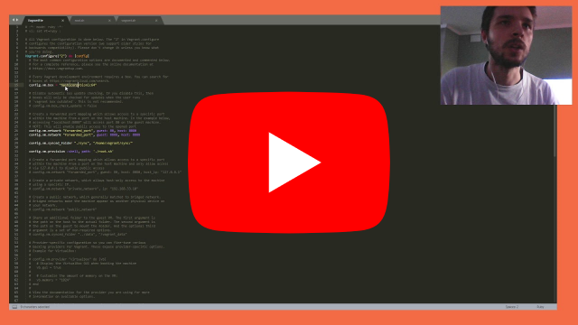

# Vagrant

Usamos Vagrant (https://vagrantup.com) para compartir maquinas virtuales que ya tienen las herramientas que precisamos para desarrollar software y nos permiten trabajar independientemente del sistema operativo de nuestra computadora.

###	Funcion

Vagrant es un programa que funciona encima de VirtualBox (https://www.virtualbox.org/), un programa de virtualizacion que permite crear maquinas virtuales sin tener que cambiar nuestro sistema operativo actual.

El framework que nos da Vagrant nos permite crear archivos de configuracion que indican las caracteristicas que tiene que tener una maquina virtual. Estos archivos de configuracion se pueden compartir como cualquier otro archivo y les permiten al que los usa crear maquinas virtuales con las caracteristicas indicadas en el archivo.

En los proyectos en los que trabajamos generalmente incluimos archivos de configuracion de Vagrant con todo lo que se necesita para poder trabajar en cada proyecto. Tambien tenemos un archivo global que se puede usar para cualquier proyecto.

### Configuracion

Para instalar Vagrant con VirtualBox se necesita primero descargar e instalar VirtualBox (https://www.virtualbox.org/wiki/Downloads) y luego descargar e instalar Vagrant (https://www.vagrantup.com/downloads).

Nuestro archivo de configuracion global lo podes encontrar aca: https://github.com/inituy/vagrant/releases/tag/1.

Para crear una maquina virtual a partir de nuestro archivo tenes que:

1. Descargar el release de Github: https://github.com/inituy/vagrant/releases/tag/1.
2. Descomprimir el zip.
3. Abrir una terminal.
4. Ir al directorio donde se descomprimio el zip.
5. Correr `vagrant up`.

Toma unos minutos iniciar por primera vez la maquina virtual porque instala todos los programas que estan listados en la configuracion (ellos le llavan `provision`). La segunda vez que se inicia la maquina virtual no corre el `provision` y solo se inicia la maquina virtual.

Si cambias el archivo de configuracion de Vagrant y es necesario hacer `provision` de nuevo, podes correr `vagrant reload --provision` para reiniciar la maquina virtual ignorando el `provision` anterior.

Despues que la maquina virtual esta funcionando podes conectarte a ella por SSH usando `vagrant ssh`. Cuando te conectes vas a poder usar todos los comandos del sistema operativo de la maquina virtual. En nuestro caso siempre usamos Ubuntu.

