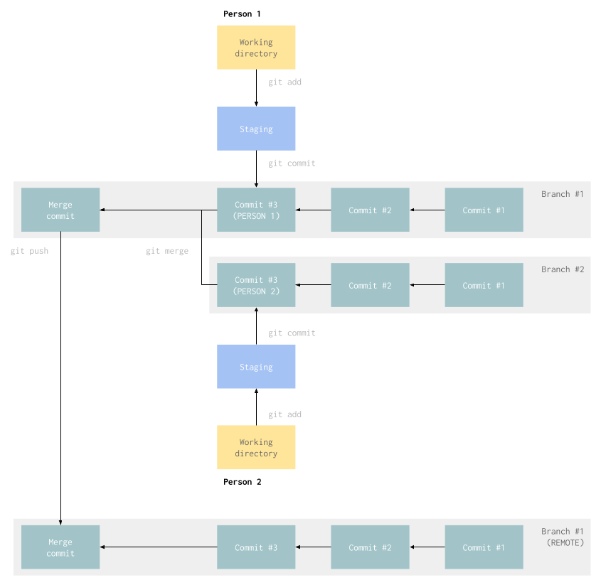

# Git

Git es un sistema de control de version que tambien sirve para distribuir codigo. Usamos Git para empaquetar codigo segun tarea y funcion y para compatirlo entre las personas que estan trabajando en un proyecto.

### Funcion

Git funciona con pequeños paquetes de codigo llamados `commits` que aparecen ordenados en el tiempo en una especie de estructura de arbol. Idealmente el codigo dentro de cada commit esta relacionado a una misma tarea o a una misma funcion dentro del sistema.

El trabajo del programador es crear los commits y agregarlos al historial. Cuando mas de una persona trabaja en el mismo proyecto creamos una copia del historial para cada una. A estas copias se le llaman `branches`.

Al terminar la tarea los programadores tienen que combinar los historiales que partieron del mismo punto pero que ahora son diferentes. A este proceso se le llama `merge`. Cuando el `merge` esta completo terminamos con una sola `branch` que contiene el historial inicial, mas los `commit` que cada programador agrego.

Un `merge` puede generar un conflicto si los dos programadores pusieron codigo diferente en la misma linea del mismo archivo pero en distintas `branch`. El proceso de `merge` te da la oportunidad de solucionar los conflictos antes de terminar.



Este es un glosario rapido para poder seguir con los comandos de Git:

1. *Repository*: Un repositorio es un proyecto en Git. Creamos un repositorio para cada aplicacion para mantener su historia separada de otros proyectos.
2. *Working directory*: Esta es la carpeta raiz del proyecto donde inicializamos el repositorio.
3. *Commit*: Es un paquete que contiene una lista de cambios al repositorio. Cuando se agrega, se modifica o se borra un archivo eso se guarda en el repositorio usando un `commit`.
4. *Branch*: Una lista de `commit` que funciona como historial de cambios hechos al repositorio. Todos los repositorios empiezan con una sola `branch`, pero se pueden tener mas de una.
5. *Remote*: Una version del mismo repositorio pero que esta en otra computadora. En casi todos los proyectos, el `remote` es la version del repositorio que esta en la nube.

### `git status`

El comando `git status` nos muestra el estado actual del working directory. Muestra que archivos cambiaron y cuales de esos cambios fueron agregados al siguiente commit.

```
$ git status

On branch banafederico
Your branch is behind 'origin/banafederico' by 2 commits, and can be fast-forwarded.
  (use "git pull" to update your local branch)

Changes to be committed:
  (use "git reset HEAD <file>..." to unstage)

        new file:   spec/presentation/present_nothing_spec.js

Changes not staged for commit:
  (use "git add <file>..." to update what will be committed)
  (use "git checkout -- <file>..." to discard changes in working directory)

        modified:   app/data/find_or_save_user_by_email.js

Untracked files:
  (use "git add <file>..." to include in what will be committed)

        app/data/save_session_request_for_user.js
        app/presentation/present_nothing.js
        spec/data/save_session_request_for_user_spec.js
```

### `git add`

Agrega uno de los archivos que cambiaron al siguiente commit. Se pueden agregar todos los archivos pasandole `-A` por parametro.

```bash
git add app/data/save_session_request_for_user.js # Agrega un archivo
git add spec/data/ # Agrega todos los cambios dentro del directorio al siguiente commit
git add -A # Agrega todos los cambios al siguiente commit
```

### `git commit`

Crea un commit. Si no se usa el parametro `-m` para agregarle el mensaje de commit, abre un editor de texto en la consola.

Con `-m` crea el commit sin mas interaccion:

```
$ git commit -m "Git updated picture"

[master cf3ad67] Git updated picture
 1 file changed, 0 insertions(+), 0 deletions(-)
 rewrite _nextgen/git/git.png (99%)
```

Sin `-m` abre el editor de texto en consola para agregarle el mensaje de commit:

```
$ git commit
```

```
  1 Git updated picture
  2 # Please enter the commit message for your changes. Lines starting
  3 # with '#' will be ignored, and an empty message aborts the commit.
  4 #
  5 # On branch master
  6 # Your branch is up to date with 'origin/master'.
  7 #
  8 # Changes to be committed:
  9 #&modified:   _nextgen/git/git.png
```
```
[master cf3ad67] Git updated picture
 1 file changed, 0 insertions(+), 0 deletions(-)
 rewrite _nextgen/git/git.png (99%)
```

### `git reset`

Este comando retrocede en la historia, borrando los commits pero sin modificar los archivos. Sin parametros, `git reset` borra los cambios que se agregaron al siguiente commit. Si se le pasa un ID de commit, `git reset` elimina commits del final de la historia hasta llegar al commit indicado.

Sin parametros funciona de esta manera:

```
$ git status

On branch master
Your branch is ahead of 'origin/master' by 2 commits.
  (use "git push" to publish your local commits)

Changes not staged for commit:
  (use "git add <file>..." to update what will be committed)
  (use "git checkout -- <file>..." to discard changes in working directory)

        modified:   _nextgen/README.md
        modified:   _nextgen/git/README.md

no changes added to commit (use "git add" and/or "git commit -a")
```

```
$ git add _nextgen/README.md
$ git status

On branch master
Your branch is ahead of 'origin/master' by 2 commits.
  (use "git push" to publish your local commits)

Changes to be committed:
  (use "git reset HEAD <file>..." to unstage)

        modified:   _nextgen/README.md

Changes not staged for commit:
  (use "git add <file>..." to update what will be committed)
  (use "git checkout -- <file>..." to discard changes in working directory)

        modified:   _nextgen/git/README.md
```

```
$ git reset

Unstaged changes after reset:
M       _nextgen/README.md
M       _nextgen/git/README.md
```

```
$ git status

On branch master
Your branch is ahead of 'origin/master' by 2 commits.
  (use "git push" to publish your local commits)

Changes not staged for commit:
  (use "git add <file>..." to update what will be committed)
  (use "git checkout -- <file>..." to discard changes in working directory)

        modified:   _nextgen/README.md
        modified:   _nextgen/git/README.md

no changes added to commit (use "git add" and/or "git commit -a")
```

### `git checkout`

Este comando sirve para volver para atras cambios hechos a los archivos, para crear nuevas branch y cambiarse de branch.

Si se le pasa un archivo o un directorio por parametro, `git checkout` lo vuelve a como estaba en el ultimo commit, o sea, borra todos los cambios que se le hicieron.

```
$ git status

On branch master
Your branch is up to date with 'origin/master'.

Changes not staged for commit:
  (use "git add <file>..." to update what will be committed)
  (use "git checkout -- <file>..." to discard changes in working directory)

        modified:   _nextgen/git/README.md

no changes added to commit (use "git add" and/or "git commit -a")
```

```
$ git checkout _nextgen/git/
$ git status

On branch master
Your branch is up to date with 'origin/master'.

nothing to commit, working tree clean
```

Tambien se puede usar el parametro `-b` para crear un nuevo branch.

```
$ git status

On branch master
Your branch is up to date with 'origin/master'.

nothing to commit, working tree clean
```

```
$ git checkout -b minuevabranch

Switched to a new branch 'minuevabranch'
```

```
$ git branch

  master
* minuevabranch
```

```
$ git status

On branch minuevabranch
nothing to commit, working tree clean
```

Si no le pasamos `-b` pero si le ponemos el nombre de un branch, nos cambia a ese branch.

```
$ git checkout minuevabranch

Switched to branch 'minuevabranch'
```

### `git merge`

Con `git merge` agregamos los commits de una branch dentro de otra. Se crea un nuevo commit en la branch destino que tiene los cambios que vienen de la branch de origen.

Si hay conflictos (cambios al mismo codigo de maneras distintas) entre las branches, los archivos que necesitan ajustes quedan en el working directory para que los agregues al commit de merge. En este caso hay que editar los archivos para quitar los conflictos, usar `git add` y despues `git commit`.

```
$ git status

On branch otrabranch
Changes not staged for commit:
  (use "git add <file>..." to update what will be committed)
  (use "git checkout -- <file>..." to discard changes in working directory)

        modified:   _nextgen/git/README.md

no changes added to commit (use "git add" and/or "git commit -a")
```

```
$ git commit -a -m "README"

[otrabranch bcd1c96] README
 1 file changed, 7 insertions(+), 1 deletion(-)
```

```
$ git checkout master

Switched to branch 'master'
Your branch is up to date with 'origin/master'
```

```
$ git merge otrabranch

Updating 55d4c85..03e6e47
Fast-forward
 _nextgen/git/README.md | 2 +-
 1 file changed, 1 insertion(+), 1 deletion(-)
```

### `git push`

Este comando sirve para enviar el historial de commits a un remote. Funciona solamente si el remote tiene el mismo historial sin los nuevos commits agregados. Si el remote no tiene los mismo commits (tiene otros commits despues del ultimo commit en comun) es necesario hacer `git pull` para traer los commits que estan en el remote, resolver conflictos y pushear de nuevo.

```
$ git status

On branch master
Your branch is up to date with 'origin/master'.

Changes not staged for commit:
  (use "git add <file>..." to update what will be committed)
  (use "git checkout -- <file>..." to discard changes in working directory)

        modified:   _nextgen/git/README.md

no changes added to commit (use "git add" and/or "git commit -a")
```

```
$ git commit -a -m "README"

[master d207d39] README
 1 file changed, 24 insertions(+)
```

```
$ git push origin master

Counting objects: 5, done.
Compressing objects: 100% (5/5), done.
Writing objects: 100% (5/5), 749 bytes | 107.00 KiB/s, done.
Total 5 (delta 2), reused 0 (delta 0)
remote: Resolving deltas: 100% (2/2), completed with 2 local objects.
To github.com:inituy/onboarding
   c32dd49..d207d39  master -> master
```

<hr />

[](../nginx/)
