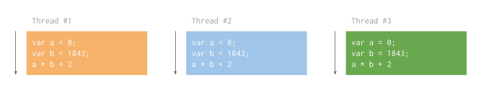
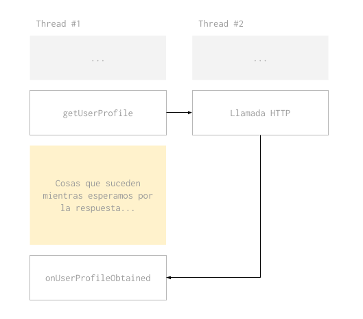

# Javascript

En esta parte del curso vamos a repasar algunos conceptos basicos de Javascript y otros no tan basicos. Javascript es nuestro lenguaje preferido porque es sencillo (a pesar de su sintaxis) y sirve tanto para frontend como para backend.

Vamos a empezar hablando de las funciones como el bloque fundamental del lenguaje sobre lo que vamos a construir todo lo demas.

### Funciones

[](https://youtu.be/2EGVAWdD_hQ)

Asi como un programa es un conjunto de sentencias que se ejecutan una despues de la otra, una funcion tambien se puede ver como una serie de sentencias que vamos a ejecutar mas tarde.

Los elementos que componen una funcion son los siguientes:

1. *Parametros*: Son variables que reciben su valor cada vez que se llama la funcion. Por ejemplo, si tuvieramos una funcion para sumar dos numeros, los numeros serian parametros y cambiarian con cada ejecucion de la funcion.
2. *Cuerpo*: El cuerpo de una funcion es donde estan las sentencias que se ejecutan cuando se ejecuta la funcion.
3. *Retorno*: Es el resultado de ejecutar la funcion. En el ejemplo de la suma, el retorno de la funcion es el resultado de la suma.


En Javascript, las funciones son objetos de "primera clase". Esto significa que una funcion en Javascript es un objeto propiamente dicho, que puede tener propiedades y hasta metodos.

No todos los lenguajes tienen esta caracteristica. En muchos lenguajes lo mas parecido a una funcion que podemos encontrar son los metodos, que solo pueden existir dentro de los objetos (en OOP) y nunca por si solos.

Como las funciones son objetos podemos guardarlas en variables y moverlas a distintas partes de nuestro programa. En la proxima parte vamos a ver como una funcion puede recibir a otra en sus parametros y que se puede hacer con eso.

### Callback

[](https://youtu.be/JMFABDFL6aA)

Se le llama *callback* a una funcion que se le pasa por parametro a otra funcion para que esta la ejecute.

Para poder entender bien de que se tratan los callbacks, primero tenemos que hablar sobre *concurrencia*. El tema es mucho mas extenso y complicado que lo que vamos a ver abajo. Nos vamos a enfocar en lo minimo necesario para darle sentido a los callbacks.

Cuando hablamos de concurrencia, nos referimos a la capacidad que tienen las computadoras de ejecutar distintas partes de un programa en paralelo.

Y para poder entender concurrencia tenemos que hablar del concepto de *thread* o hilo. Podemos pensar en un hilo como el responsable de ejecutar las sentencias de nuestro programa siempre que no sean concurrentes. Si alguna de las sentencias del programa inicia un nuevo hilo, vamos a decir que el programa es concurrente o multi-hilo.



Cuando trabajamos con un programa concurrente tenemos que prestar atencion a la interaccion entre los hilos. Cada hilo se mueve a su ritmo y puede desaparecer o trancarse. Cuando un hilo inicia otro, el primero debe esperar a que el segundo responda y debe determinar cuanto tiempo esta dispuesto a esperar.

Para poner un ejemplo, imaginemos que tenemos una aplicacion web que hace llamadas HTTP a un servidor a medida que el usuario interactua con la interfaz.



Cuando el usuario toca un boton, la interfaz no se congela. Esto pasa porque el navegador web ejecuta las llamadas HTTP de manera concurrente. El Javascript que inicia la llamada HTTP especifica cuanto esperar y que hacer al recibir una respuesta.

Los callbacks entran en accion cuando necesitamos especificar que hacer cuando esa tarea concurrente termina o falla. Si tuvieramos una funcion llamada `getUserProfile` para hacer una llamada HTTP, esta funcion recibiria un callback que nos permita decidir que hacer con el resultado de la tarea:

```javascript
function getUserProfile(callback) {
  /* Hacemos una llamada HTTP y cuando
     obtenemos un resultado invocamos al
     callback. */
  callback(resultadoLlamadaHttp);
}

function onUserProfileObtained(userProfile) {
  /* Esta funcion se va a ejecutar cuando
     la llamada HTTP se complete y va a 
     recibir el resultado por parametro. */
}

/* Invocamos getUserProfile y le pasamos
   onUserProfileObtained como callback.
   Cuando la llamada HTTP que inicia
   getUserProfile termine, se va a ejectuar
   onUserProfileObtained. */
getUserProfile(onUserProfileObtained);
```

En el ejemplo de arriba, la funcion `onUserProfileObtained` es un callback. Porque es una funcion que se pasa por parametro a otra funcion, en este caso `getUserProfile`.

### Promise

[](https://youtu.be/TqEA1A-jLp0)

Una promesa es un objeto que representa una tarea que todavia no termino de ejecutar. Esta tarea puede terminar exitosamente o no, y la interfaz de `Promise` nos permite interactuar con ambos casos.


Un objeto `Promise` tiene dos metodos llamados `then` y `catch`. El metodo `then` recibe una funcion como parametro (callback) que se ejecuta si la tarea que la promesa representa termina con exito. El metodo `catch` funciona de la misma manera, pero se ejecuta cuando la tarea termina en error. En ambos casos el callback recibe el resultado de la tarea.

```javascript
var promise = readFile(filepath);

promise.then(function (file) {
  console.log('Read successfully!', file);
});

promise.catch(function (error) {
  console.log('Could not read file!', error);
});
```

Los metodos `then` y `catch` son muy versatiles y nos permiten hacer muchas cosas distintas. Por ejemplo, podemos llamar `then` tantas veces como queramos y asignarle mas de un callback a la misma tarea. Todos los callbacks en el siguiente ejemplo se ejecutan al terminar de leer el archivo:

```javascript
var promise = readFile(filepath);

/* Con este callback le vamos a avisar al
   usuario que el archivo se leyo con exito. */
promise.then(function (file) {
  console.log('Read successfully!', file);
});

/* En este vamos a dejar registro de que
   leimos el archivo. */
promise.then(function (file) {
  return saveLog(file);
});

/* En este vamos a copiar el archivo usando
   otra funcion. */
promise.then(function (file) {
  return copyFile(file, copypath);
});
```

Tambien podemos encadenar tareas asincronicas para que una empiece cuando termina la anterior. Esto lo podemos hacer porque tanto `then` como `catch` devuelven a su vez un nuevo objeto `Promise`. La tarea que reprensenta este nuevo objeto es la que lleva a cabo el callback.

En el ejemplo que viene, los callbacks no se ejecutan todos a la vez sino que uno se ejecuta cuando termina el anterior:

```javascript
var promise1 = readFile(filepath);
var promise2 = promise1.then(function (file) {
  console.log('Read successfully!', file);
  return file;
});
var promise3 = promise2.then(function (file) {
  return saveLog(file);
});
promise3.then(function (file) {
  return copyFile(file, copypath);
});
```

En el siguiente ejemplo lo vemos escrito de otra manera, sin guardar cada promesa en una variable sino llamando directamente el metodo `then` sobre el resultado de la ejecucion anterior. Resulta mas facil de entender que una tarea sucede a la anterior:

```javascript
readFile(filepath)
  .then(function (file) {
    console.log('Read successfully!', file);
    return file;
  })
  .then(function (file) {
    return saveLog(file);
  })
  .then(function (file) {
    return copyFile(file, copypath);
  });
```


Si quisieramos nosotros mismos la funcion `readFile` que devuelve un `Promise` podriamos hacerlo de la siguiente forma:

```javascript
/* Vamos a escribir nuesta propia funcion
   `readFile` que recibe el path de un
   archivo y devuelve el contenido. */
function readFile(filepath) {
  /* Creamos una promesa con `new Promise`.
     Le pasamos por parametro la funcion que
     va a llevar a cabo la tarea. */
  return new Promise(function (exito, error) {
    if (fileExists(filepath))
      // Hace que se ejecuten los `then`.
      exito({ }); 
    else
      // Hace que se ejecuten los `catch`.
      error('No existe el archivo.');
  });
}
```

Usamos `new Promise` para crear una nueva promesa y le pasamos la funcion que va a llevar a cabo la tarea. Esta funcion va a recibir dos funciones por parametro (`exito` y `error` en el ejemplo) que sirven para finalizar el `Promise`.

Si ejecutamos el primer callback (`exito`) vamos a estar marcando la promesa como finalizada exitosamente. El segundo callback (`error`) se ejecuta cuando hay un error. Ejecutar los callback hace que la promesa continue hacia los `then` o `catch` que se le hayan asignado.

Tambien podemos crear promesas usando los metodos `resolve` y `reject`. Con estos metodos creamos promesas que ya estan finalizadas y que ejecutan sus `then` o `catch` inmediatamente:

```javascript
Promise.resolve(123).then(function (value) {
  console.log(value); // Imprime 123
});

Promise.reject(789).catch(function (error) {
  console.log(error); // Imprime 789
});
```

### Closures

[](https://youtube.com/watch?v=Vescsbo3VC0)

En Javascript, una funcion se puede crear en cualquier momento de la ejecucion del programa. De hecho, cada vez que usamos la palabra clave `function` estamos creando una nueva funcion. Un ejemplo como el siguiente crearia mucha cantidad de funciones:

```javascript
/* Creamos una funcion anonima para
   poder pasarsela como callback
   a `forEach`. */
filepaths.forEach(function (filepath) {
  /* Creamos una funcion mas por cada vez
     que se ejecuta el callback de `forEach`.
     Cuando `forEach` termine  vamos a
     haber creado tantas funciones como
     elementos hubo en el array `filepaths`. */
  fs.readFile(filepath, function (error, file) {
    console.log('Leimos este archivo:', filepath, file);
  });
});
```

Cada vez que se crea una funcion, tambien se crea un "closure". Un closure es una referencia al contexto donde la funcion fue creada. La funcion "recuerda" en que contexto fue creada para poder usar sus variables.

Por ejemplo, en el codigo de arriba el callback de `readFile` puede acceder a la variable `filepath` porque fue creada dentro del callback de `forEach`.


Los closures viven en el programa hasta que la funcion a la que estan conectados desaparece. Para entender como es que una funcion desaparece del programa tenemos que hablar sobre contextos de ejecucion.

Cuando ejecutamos una funcion, el interprete de Javascript (NodeJS, un navegador web o donde sea que corre nuestro programa) reserva un espacio en la memoria del sistema para esa funcion.

En esta memoria se guardan los valores de los parametros y todas las variables que se definen dentro de la funcion. Cuando la funcion termina de ejecutar esta memoria se libera y las variables y parametros desaparecen. Si se definio una funcion dentro del contexto de ejecucion esta tambien desaparece.

```javascript
function doStuffWithFiles(filepaths) {
  filepaths.forEach(function (filepath) {
    fs.readFile(filepath, function (error, file) {
      // do stuff
    });
  });
}

/* El interprete va a reservar memoria para
   la ejecucion de esta funcion y al terminar
   de ejecutarla va a descartar los valores
   de los parametros, las variables y las
   funciones que se crearon en ese contexto.
   Esto incluye el callback de `forEach`,
   de `readFile` y las variables `filepaths`,
   `filepath`, `error` y `file`. */
doStuffWithFiles([...]);
```

La utilidad de los closure se puede ver cuando una funcion sobrevive al contexto de ejecucion donde fue creada. Si una ejecucion termina con el retorno de una funcion, la funcion retornada va a seguir existiendo y va a mantener en su closure el contexto de ejecucion donde fue creada.

```javascript
/* La variable `publico` se define en el contexto
   ejecucion global y todas las funciones van a 
   tener acceso a ella. */
var publico = 123;

/* Esta funcion devuelve otra funcion.
   La funcion que devuelve va a tener acceso
   al contexto de ejecucion donde se creo.
   Entonces, la funcion que se devuelve va
   a poder leer la variable `secreto`. */
function prepararFuncionSecreta() {
  /* La variable `secreto` se define dentro
     del contexto de ejecucion de `prepararFuncionSecreta`. */
  var secreto = 456;

  /* La funcion `funcionSecreta` tambien se
     define dentro del contexto de ejecucion de
     `prepararFuncionSecreta` por lo tanto el
     sigue vivo en su closure. */
  return function funcionSecreta() {
    console.log(publico, secreto);
  };
}

/* La variable `fn` ahora tiene como valor a
   la `funcionSecreta`, que tiene en su closure
   el contexto de ejecucion que se creo para
   `prepararFuncionSecreta`. */
var fn = prepararFuncionSecreta();

/* Llamar a `fn` imprime 123456. 
   La `funcionSecreta` tiene acceso a la variable `secreto`
   a traves de su closure y a `publico` a traves del
   closure de `prepararFuncionSecreta`. */
fn();
```

A traves de los closures, el contexto de ejecucion de una funcion tiene acceso al contexto de ejecucion donde la funcion se creo. Este efecto se repite en cada funcion y asi cada funcion tiene acceso al contexto de ejecucion global a traves de los closures.

### Serializacion

[](https://youtube.com/watch?v=Vescsbo3VC0)

Se le dice serializacion al proceso por el cual transformamos un objeto en un string u otro formato que se puede enviar fuera del programa. El formato que vamos a ver ahora es JSON (JavaScript Object Notation).

Cuando necesitamos enviar un objeto a otro programa, por ejemplo si nos comunicamos con un servidor web, tenemos que serializarlo primero. Como no podemos pasarle variables a otros programas, o a traves de una red, tenemos que enviarle un string.

Javascript tiene una libreria que viene incluida con el lenguaje para convertir objetos en strings JSON:

```javascript
JSON.stringify({ importante: 123456 }); // '{"importante":123456}'
```

Tambien convierte strings JSON en objetos:

```javascript
JSON.parse('{"importante":123456}'); // { importante: 123456 }
```

No se pueden serializar funciones por lo que explicamos en la seccion anterior. Para poder pasar el contexto entero de una funcion necesitariamos serializar el contexto de ejecucion global, o sea todo el programa.

[En esta pagina](https://developer.mozilla.org/en-US/docs/Web/JavaScript/Reference/Global_Objects/JSON#Full_JSON_syntax) podes encontrar la sintaxis JSON entera.

### Patrones de diseño

[](https://youtube.com/watch?v=Vescsbo3VC0)

Para terminar con Javascript vamos a ver como se pueden aplicar algunos patrones de diseño. Estos patrones de diseño fueron creados para programacion orientada a objetos pero podemos aprovechar las similitudes para aplicarlos en programacion con funciones.

Los patrones que vienen mas abajo son los que aplicamos todos los dias cuando programamos APIs y aplicaciones web.

#### [Command pattern](https://en.wikipedia.org/wiki/Command_pattern)

Un "command" en programacion orientada a objetos es un objeto ejecutable. Estos objetos tienen un metodo `execute` que hace lo que sea que el objeto tenga que hacer.

A estos objetos nosotros les llamamos funciones. Las funciones son basicamente objetos ejecutables e incluyen un metodo `call` aparte de la sintaxis `()` que tambien las ejecuta.

#### [Strategy pattern](https://en.wikipedia.org/wiki/Strategy_pattern)

El strategy pattern se usa cuando necesitamos elegir que funcion usar con el programa funcionando.

Puede ser que necesitemos usarlo porque la funcionalidad de nuestro programa varia segun su estado, o simplemente podemos aplicar el strategy pattern para nos sea mas facil mantener el codigo para determinadas funciones del sistema.

Veamos un ejemplo de como la funcionalidad varia segun el estado. Este sistema de ejemplo registra la entrada y salida de personas de un edificio, y debe actuar diferente segun el horario en el que se registran las entradas. Cuando una persona entra entre las 22:00 y las 6:00, el sistema notifica a seguridad, fuera de ese horario notifica a recursos humanos.

Digamos que seguridad y recursos humanos son dos grupos diferentes de personas y que cada una quiere poder programar la manera en la que se les notifica. Podemos usar el strategy pattern para tener una funcion para cada grupo de personas.

```javascript
/* La funcion `notificar` es nuestra "estrategia"
   y va a variar segun como se llame a `registrarEntrada`.
   Esta funcion la va a mantener el equipo de TI. */
function registrarEntrada(entrada, notificar) { 
  validarEntrada(entrada);
  guardarEntradaEnBaseDeDatos(entrada);
  notificar(entrada);
}

/* Esta funcion la va a mantener el equipo de seguridad
   del edificio. */
function notificarSeguridad(entrada) {
  llamar911();
}

/* Esta funcion la va a mantener el equipo de recursos
   humanos de la empresa. */
function notificarRecursosHumanos(entrada) {
  empezarContadorDeHoras();
}

/* Nuestro sensor de entrada nos notifica cuando
   hay datos nuevos. */
sensor.addEventListener(function sensorActivado(sensorData) {
  var strategy;

  switch (new Date().getHours()) {
    case 22:
    case 23:
    case  0:
    case  1:
    case  2:
    case  3:
    case  4:
    case  5:
      strategy = notificarSeguridad;
      break;
    default:
      strategy = notificarRecursosHumanos;
  }

  registrarEntrada(sensorData, strategy);
});
```

Ahora veamos un ejemplo donde el mismo programador elige usar el strategy pattern para darse la libertad de poder cambiar facilmente una parte de la funcionalidad sin cambiar otras.

En este caso el programador tiene que guardar un usuario en la base de datos, pero no esta seguro que base de datos es mejor. Va a empezar usando MongoDB, pero capaz despues necesite cambiarse a PostgresSQL. Vamos a ver como podemos separar la logica de negocio (las reglas para guardar un usuario) y el codigo de base de datos.

```javascript
/* Nuestra funcion `guardarUsuario` sabe todo
   lo que se debe hacer para guardar un nuevo
   usuario en el sistema, excepto como persistirlo
   en la base de datos. */
function guardarUsuario(usuario, persistir) {
  usuario.id = generarIdUsuario();
  persistir(usuario);
  return usuario;
}

/* Esta funcion va a recibir datos del usuario
   y lo va a guardar en MongoDB. */
function persistirUsuarioEnMongoDb(usuario) {
  // ...
}

/* Esta funcion va a recibir datos del usuario
   y lo va a guardar en PostgresSQL. */
function persistirUsuarioEnPostgresSql(usuario) {
  // ...
}

function crearNuevoUsuario(inputUsuario) {
  validarInputUsuario(inputUsuario);

  /* En este caso no es una condicion del sistema
     la que decide que strategy usar, sino que el
     programador lo escribe asi para tener la
     comodidad de poder cambiarlo facilmente despues. */
  guardarUsuario(inputUsuario, persistirUsuarioEnMongoDb);

  enviarEmailNuevoUsuario(inputUsuario);
}
```

Una vez que tenemos instalado un stategy pattern, es sencillo agregar nuevas estrategias. Muy facilmente podriamos notificar a un tercer grupo sobre la entrada de personas o agregar una funcion nueva para guardar usuarios en la base de datos.

#### [Factory pattern](https://en.wikipedia.org/wiki/Factory_(object-oriented_programming))

En programacion orientada a objetos, una "factory" es un objeto cuya responsabilidad es crear otros objetos. En programacion funcional, esta mas relacionado al concepto de "[aplicacion parcial](https://en.wikipedia.org/wiki/Partial_application)".

Este patron se aplica cuando la creacion de un objeto es mas compleja que simplemente usar `new` o crear la funcion. Por ejemplo, si necesitamos limitar la cantidad de objetos que existen de un tipo en particular o si la configuracion de un objeto es tan compleja que necesitamos especificarla en un objeto aparte.

Veamos un ejemplo de lo primero. Cuando nos conectamos a una base de datos no queremos estar creando conexiones nuevas a cada rato. Incluso si cerramos las conexiones que no vamos a usar mas, el costo de conectarnos cada vez que hacemos una consulta es innecesario. Este problema se soluciona aplicando el factory pattern para controlar la creacion de conexiones.

En el siguiente ejemplo vamos a ver una funcion que mantiene una sola conexion activa. Crea la conexion la primera vez que se ejecuta, y luego sigue devolviendo la misma conexion. Podriamos decir que esta funcion es un factory de conexiones:

```javascript
var activa;

/* La funciona `conectar` aplica el factory
   pattern para controlar la creacion de
   conexiones a la base de datos. */
function conectar() {
  return !activa ? baseDeDatos.conectar() : activa;
}

/* Todas las conexiones a la base de datos se
   deben hacer a traves del factory. */
conectar().then(function (conexion) {
  conexion.consulta('...');
});
```

Ahora un ejemplo de configuracion compleja. Imaginemos un programa que usa [inyeccion de dependencia](https://en.wikipedia.org/wiki/Dependency_injection). Este programa tiene un objeto o funcion que tiene la sola responsabilidad de distribuir funcionalidad entre ciertos otros objetos del sistema.

Sigamos el ejemplo de mas arriba donde pasamos la funcion de persistencia por parametro. En algun momento nuestro programa va a necesitar una funcion llamada `guardarUsuario` que simplemente guarde el usuario sin necesidad de configurar. Para esto vamos a tener un factory que nos devuelva la funcion `guardarUsuario` ya configurada.

```javascript
/* La funcion `prepararGuardarUsuario` nos
   va a devolver otra funcion que ya tiene la
   configuracion que precisa. En este caso,
   el strategy de persistencia. */
function prepararGuardarUsuario() {
  return function guardarUsuarioEnMongoDb(usuario) {
    /* De la misma manera que en el ejemplo sobre
       strategy pattern, esta funcion no cambia en
       base al estado del sistema sino que le 
       facilita al programador cambiarlo despues.
       Para cambiar de una base de datos a otra,
       solamente hay que cambiar la function
       `persistirUsuarioEnMongoDb` por otra que
       tenga la misma funcionalidad. */
    return guardarUsuario(usuario, persistirUsuarioEnMongoDb);
  }
}

inicializarPrograma({
  guardarUsuario: prepararGuardarUsuario()
});
```

#### [Pipeline pattern](https://en.wikipedia.org/wiki/Pipeline_\(software\))

Le llamamos "pipeline" a una lista de funciones a aplicar sobre una estructura de datos, con un orden en particular, y donde el retorno de una funcion sirve de parametro para la siguiente.

En nuestro caso usamos este patron para transformar casos de uso o experiencias de usuario en codigo. Un caso de uso en cualquier programa puede ser escrito como una lista de tareas que el usuario tiene que llevar a cabo para conseguir un resultado determinado.

En Javascript podemos usar objetos del tipo `Promise` como los que estudiamos mas arriba para implementar el pipeline pattern.

```javascript
/* La funcion `actualizarPerfil` implementa
   el pipeline pattern para describir el
   caso de uso por el cual el usuario actualiza
   su perfil. */
function actualizarPerfil(datos) {
  /* Cada funcion del pipeline recibe como
     parametro el resultado de la ejecucion
     anterior. */
  return Promise.resolve(datos)
    .then(validarSesionDeUsuario)
    .then(validarDatosDePerfil)
    .then(guardarDatosDePerfil)
    .then(presentarDatosDePerfil)
    .catch(presentarError);
}
```

Esto nos permite encapsular cada uno de los pasos del caso de uso en funciones separadas, que tienen una o dos responsabilidades sencillas y son super faciles de testear.

<hr />

[](../architecture/)
