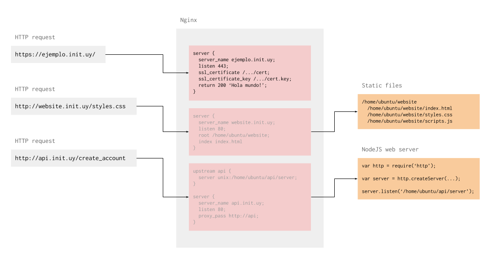

# Nginx

Nginx es un servidor web que requiere muy poca configuracion.

### Funcion

Usamos Nginx para distribuir el trafico web entre diferente proyectos y para asegurarlo usando HTTPS. Elegimos Nginx sobre otros servidores web por lo facil que es configurarlo.



### Configuracion

Para instalar Nginx en Ubuntu hay que correr este comando:

```
sudo apt-get install nginx
```

El archivo de configuracion esta en `/etc/nginx/nginx.conf`. La configuracion por defecto es suficiente como para trabajar en un ambiente de desarrollo.

Para configurar servidores virtuales tenes que agregar archivos en la carpeta que esta en `/etc/nginx/sites-enabled`. Un archivo de configuracion de un servidor virtual es mas o menos asi:

```javascript
server {
  // server_name: Permite nombrar el servidor
  // para que Nginx lo seleccione usando SNI
  // (https://en.wikipedia.org/wiki/Server_Name_Indication).
  server_name api.init.uy;

  // listen: El servidor va a recibir trafico
  // a traves del puerto 443 que es el estandar
  // para HTTPS (https://en.wikipedia.org/wiki/List_of_TCP_and_UDP_port_numbers).
  listen 443;

  // Configuracion de los certificados SSL. En
  // este caso los certificados se consiguen con 
  // Let's Encrypt (https://letsencrypt.org/)
  ssl on;
  ssl_certificate /etc/letsencrypt/live/api.init.uy/fullchain.pem;
  ssl_certificate_key /etc/letsencrypt/live/api.init.uy/privkey.pem;

  // Configuracion para la redireccion de trafico.
  location / {
    // ...
  }
}
```

#### Respuesta fija

Para configurar las respuestas directamente en la configuracion de Nginx usamos lo siguiente:

```javascript
server {
  // server_name, listen, ssl;

  location / {
    // Cualquier request que termine en este
    // bloque va a recibir una respuesta con
    // status code 302 y header
    // "Location: htps://api.init.uy"
    return 302 "https://api.init.uy"

    // Los request que terminen en este bloque
    // reciben una respuesta con status code
    // 200 y cuerpo "Hola Mundo".
    return 200 "Hola Mundo";
  }
}
```

Esto se puede usar para configurar un redirect, para probar que el servidor web este levantado o para devolver errores en ciertas URLs.

#### Contenido estatico

La siguiente configuracion sirve contenido estatico desde un directorio:

```javascript
server {
  // server_name, listen, ssl;

  location / {
    // El root del servidor va a ser este directorio.
    // Para una URL de este estilo:
    // https://website.init.uy/blog/articulo.html
    // Va a devolver el contenido del archivo en
    // /home/ubuntu/website/blog/articulo.html
    root /home/ubuntu/website/;

    // Cuando la URI apunte a un directorio
    // y no a un archivo, por ejemplo,
    // https://init.uy/blog/ el servidor web
    // va a devolver el contenido de
    // /home/ubuntu/website/blog/index.html
    index index.html;
  }
}
```

Esta configuracion la usamos si estamos desarrollando un sitio web o una aplicacion web que sirve contenidos estaticos como HTML, CSS, Javascript, imagenes, etc.

#### Redirigir a otro servidor

En ocasiones vamos a tener otro servidor web funcionando y vamos a querer que Nginx redirija el trafico para ahi. Lo podemos hacer con la siguiente configuracion:

```javascript
// Con upstream le decimos a Nginx donde
// estan los servidores donde queremos redirigir
// el trafico y tambien podemos especificarle
// que estrategia usar para elegir de entre
// los servidores.
upstream api {
  // Con least_conn, Nginx va a redirigir la
  // siguiente request al servidor con la menor
  // cantidad de conexiones activas.
  // Hay otras configuraciones para balanceo de
  // carga tambien (http://nginx.org/en/docs/http/load_balancing.html).
  least_conn;

  // Lista de los servidores a donde Nginx
  // va a redirigir el trafico.
  // Pueden estar en otros dominios, en un
  // archivo (https://serverfault.com/questions/124517/what-is-the-difference-between-unix-sockets-and-tcp-ip-sockets)
  // o IP.
  server api2.init.uy;
  server unix:/home/ubuntu/api/server.sock;
  server 127.0.0.1:8080;
}

server {
  // server_name, listen, ssl;

  // Todo el trafico se redirige al
  // upstream con nombre "api" usando
  // HTTP simple.
  location / {
    proxy_pass http://api;
  }
}
```

Esta configuracion la usamos cuando tenemos una aplicacion corriendo que esta configurada para recibir trafico en un puerto determinado o un archivo.

Por ejemplo, cuando hacemos una API en NodeJS, levantamos un servidor web que recibe trafico desde un archivo de esta manera:

```javascript
var http = require('http');

var server = http.createServer(function (request, response) {
  response.end('Gracias.');
});

server.listen('/home/ubuntu/api/server.sock');
```

Luego usamos `proxy_pass` para que Nginx envie el trafico a ese archivo luego de validar el certificado HTTPS y otros filtros previos.

<hr />

[](../mongo/)
