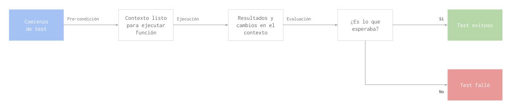
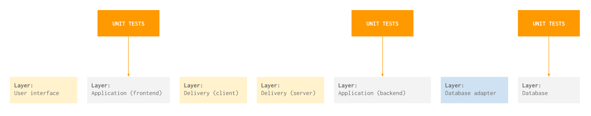
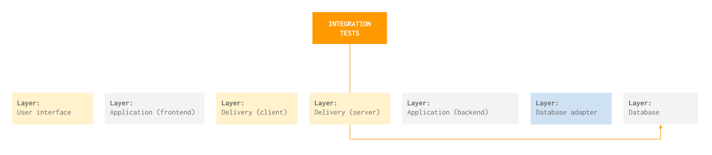
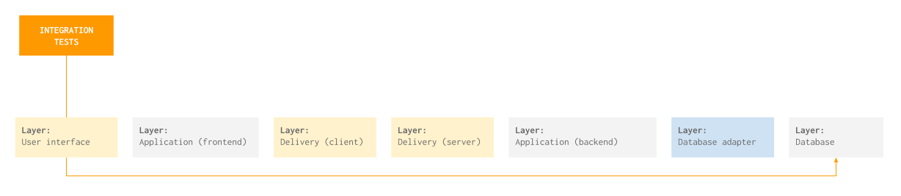
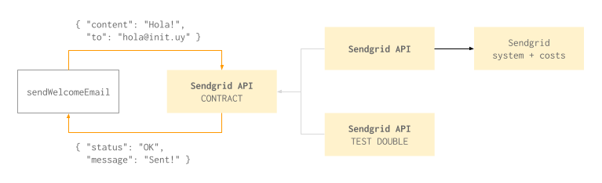
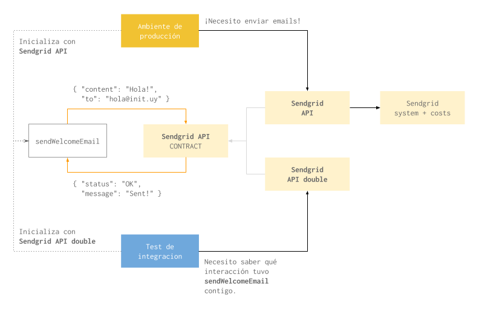
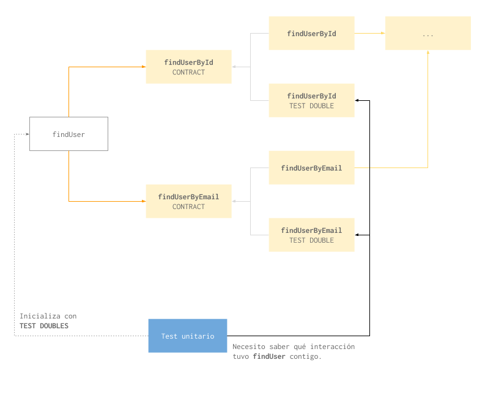

# Test-driven development

TDD es una disciplina que consiste de crear pruebas automatizadas (tests) antes de crear el codigo de aplicacion. Practicar esta disciplina nos obliga a encarar el desarrollo desde otro punto de vista y nos da beneficios que no tendriamos de otra manera, como por ejemplo, poder confiar que cuando nuestras pruebas pasan el codigo esta pronto para produccion.

### Que es un test

Una *test suite* es un programa que escribimos en paralelo con el codigo de aplicacion que se encarga de usar el sistema principal y evaluar su funcionamiento.

La test suite deberia interactuar con todos los elementos de la aplicacion mas de una vez, de todas las maneras posibles y desde varios niveles de abstraccion. Cuando practicamos test-driven development correctamente, podemos estar seguros que nuestros tests cubren todo el codigo de aplicacion.

Cuando escribimos una prueba automatizada tenemos que dejar de lado la creatividad y ver el codigo con ojo critico. Crear un test no es un ejercicio de creatividad sino de control de calidad.

El cambio de perspectiva de tester a developer y viceversa puede ser particularmente dificil, y quizas sea la parte mas dificil de practicar test-driven development.

#### Composicion

Un test tiene tres etapas que van en este orden: Precondicion, ejecucion y evaluacion.



La etapa de pre-condicion la usamos para crear el contexto necesario para poder ejecutar la funcion en cuestion de manera significativa. Por ejemplo, si estuvieramos probando una funcion que busca un usuario en la base de datos, usariamos la etapa de pre-condicion para insertar ese usuario. Si no tenemos el usuario en la base de datos, ejecutar la funcion no nos seria util ya que no podriamos evaluar si funciona.

En la segunda etapa vamos a ejecutar la funcion con los parametros que correspondan.

La ultima etapa es la de evaluacion. En base a los parametros que le pasamos en la etapa de ejecucion, vamos a verificar que el resultado de la funcion es lo que esperabamos. Siguiendo con el ejemplo de la funcion que busca el usuario, en esta etapa vamos a confirmar que la funcion encontro el usuario.

En un mismo test vamos a repetir estas tres etapas tantas veces como casos de uso tenga la funcion.

Nuestro ejemplo tiene por lo menos dos casos de uso: El caso en el que el parametro coincide con un ID de un usuario en la base de datos y el caso en el que no.

```javascript

describe('buscarUsuario', function () {
  var usuario;

  beforeAll(function () {
    /* Guardamos el usuario en la base
       de datos como pre-condicion. */
    usuario = { id: 123, email: 'usuario@servicio.com' };
    baseDeDatos.insertar(usuario); // Asumimos que funciona!
  });

  it('encuentra el usuario', function () {
    /* Ejecutamos la funcion con el ID de
       usuario correcto y verificamos
       que devuelva el usuario. */
  });

  it('no encuentra el usuario', function () {
    /* Ejecutamos la funcion con el ID de
       usuario incorrecto y verificamos
       que devuelva `null`. */
  });
});
```

A veces tambien es importante agregar una cuarta etapa, que podemos llamar post-condicion, para quitar los efectos secundarios del test. En este caso podriamos usar la post-condicion para dejar la base de datos vacia como estaba antes de empezar.

### Tipos de test

Un programa se puede probar de muchas maneras diferentes. Podemos crear pruebas que simulen ser personas reales que usan el programa desde la interfaz de usuario, que interactuen con el servidor HTTP o que trabajen sobre una sola funcion.

El tipo de test va a depender de la parte del programa con la que interactua y del objetivo del test. Como las "capas" de un programa son muchas y hay muchas razones diferentes para probar cada una, los tipos de test que podemos escribir son muchos tambien.

En este onboarding nos vamos a enfocar en tres tipos de test: Unitarios, de integracion y de punto a punto.

#### Unit testing



Llamamos *unit test* al que prueba una sola funcion de nuestro sistema. El concepto de "unidad" puede cambiar segun cada programa, paradigma o equipo de trabajo. En un lenguaje orientado a objetos podria una clase, un grupo de clases o un metodo solo de una clase. En nuestro caso le vamos a llamar "unidad" a cada `function` que definamos en Javascript.

Los unit tests nos permiten empezar a probar nuestro sistema desde temprano y dan granularidad tal que podemos asegurar de manera individual y aislada que cada elemento funciona en el nivel mas bajo del sistema.

#### Integration testing

Un *integration test* prueba mas de una funcion en conjunto. El nivel de integracion que probamos depende mucho de las opiniones del equipo. En nuestro caso vamos a probar la integracion entre servidor HTTP, aplicacion (logica de negocio), base de datos y demas servicios externos.



Un test de interaccion desde el servidor HTTP nos ayuda a probar los puntos de entrada de nuestra API tal cual lo harian las interfaces de usuario o personas reales si nuestro producto es la API en si misma.

A este nivel de integracion los tests tambien sirven de documentacion ya que terminan siendo ejemplos completos de todas las interacciones posibles con el servidor HTTP.

Los tipos de tests que siguen tambien se pueden considerar tests de integracion porque prueban varias funciones interactuando entre ellas. Pero cuando hablemos de "integration testing" vamos a estar refiriendonos solamente a los tests que hacemos a traves del servidor HTTP.

#### End-to-end testing

Los tests *end-to-end* son los que simulan una persona real usando el sistema. Se ejecutan en un ambiente identico al de produccion (con excepciones) y sin tomar atajos en cuanto a la interfaz de usuario para que se lo mas parecido a la experiencia de un usuario real.



Estos tests pueden ser los que mas valor agregan al test suite pero son costosos, tanto para ejecutar como para desarrollarlos.

Cuando hacemos tests que van de una punta a la otra tenemos que considerar desde el CSS hasta los servicios externos. Por ejemplo, algunas herramientas para testing en el browser fallan si un boton que queremos cliquear no esta visible en la pantalla. Tambien podemos cometer el error de llamar una API que usa un servicio externo pago y generar un gasto innecesario.

Al mismo tiempo, este tipo de tests precisan muchas cosas funcionando a la vez y eso hace que ejecutarlos lleve mucho tiempo y recursos. Por eso es que no es parte del dia a dia del programador mantener estos tests, sino que se ejecutan de vez en cuando y no se escriben junto con la aplicacion.

### Contract testing y test doubles 

Cuando nos encontremos en una situacion donde no podemos o no queremos probar ambos lados de una interaccion, vamos a hacer *contract testing*.

Un "contrato" en este contexto se refiere a la interfaz que ofrece un elemento fuera o dentro de nuestro sistema. Por ejemplo, el contrato de nuestra funcion para buscar usuarios define los parametros que recibe (un string que debe coincidir con una ID de usuario) y los valores que devuelve (un objeto con informacion sobre el usuario o `null`).

Un ejemplo diferente puede ser el de un servicio externo que publica los parametros y resultados de los puntos de entrada de su API.

Si conocemos el contrato que un elemento se compromete a cumplir, podemos crear *test doubles* que reemplacen al elemento en situaciones donde no nos conviene tenerlo. Nuestros test doubles van a estar atados al mismo contrato que el elemento real pero sin los costos relacionados.



Vamos a usar esta estrategia en los distintos tipos de tests.

#### Integration testing

Basicamente en cualquier test que no sea un *unit test* vamos a crear test doubles para todos los servicios externos.

Tanto en integration testing como end-to-end, cuando inicialicemos el servidor HTTP lo vamos a hacer pasandole sus dependencias reales excepto las que sean adaptadores a servicios externos. Estos adaptadores los vamos a remplazar por test doubles que respeten el contrato, pero que devuelvan resultados preestablecidos. Estos test doubles van a recolectar informacion de uso que luego vamos a usar para verificar que el resto de las funciones hayan respetado el contrato en su interaccion.



Asi logramos probar nuestro sistema a traves del servidor HTTP sin gastar creditos en los servicios externos y reducimos el tiempo que lleva ejecutar los tests.

#### Unit testing

El otro caso en el que vamos a querer hacer *contract testing* es cuando probamos funciones que dependen de otras funciones. Cuando hacemos unit testing no queremos que participen otras funciones aparte de la que queremos probar entonces creamos test doubles para cada una de las dependencias de la funcion que queremos probar, y verificamos las interacciones.



### Las tres reglas de test-driven development

Finalmente, las tres reglas que hay que respetar para aplicar TDD correctamente son las siguientes:

1. No se debe escribir codigo de aplicacion a menos que sea para satisfacer un test que esta fallando. Esto quiere decir que debemos empezar por escribir el test.
2. No se debe escribir del test de lo necesario para que este falle.
3. No se debe escribir mas codigo de aplicacion que el necesario para satisfacer el test que esta fallando.

Si seguimos estas reglas al pie de la letra terminamos yendo y viniendo de los tests al codigo en ciclos muy cortos. Como deciamos al principio, la dificultad esta en cambiar de la mentalidad creativa a la critica con cada vuelta.

<hr />

[](https://youtu.be/Twjysgzmphk)

[](../)
